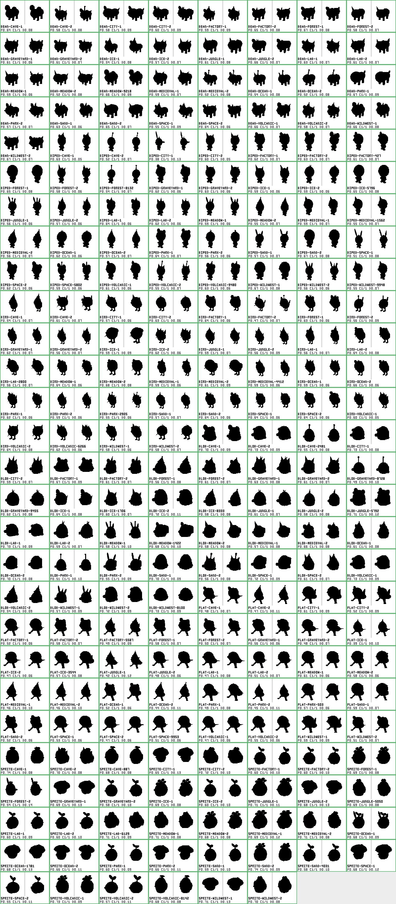
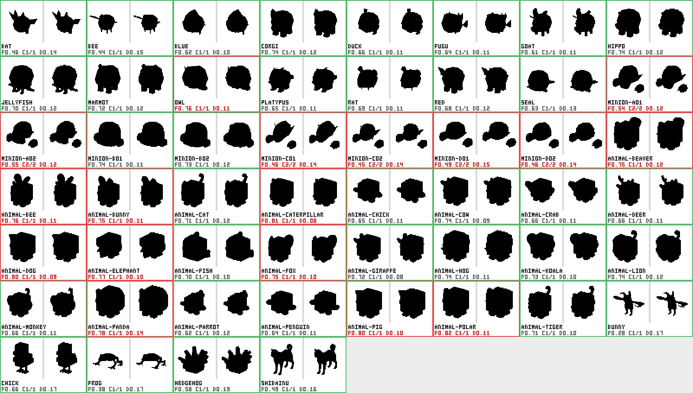
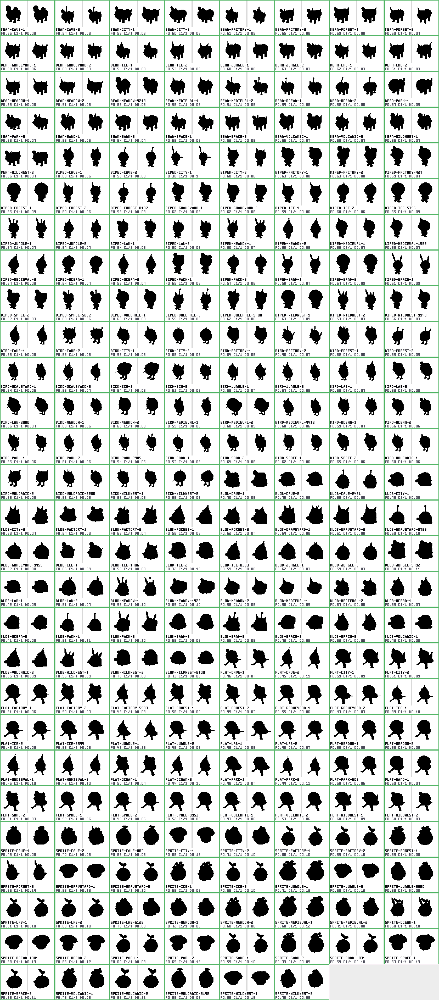
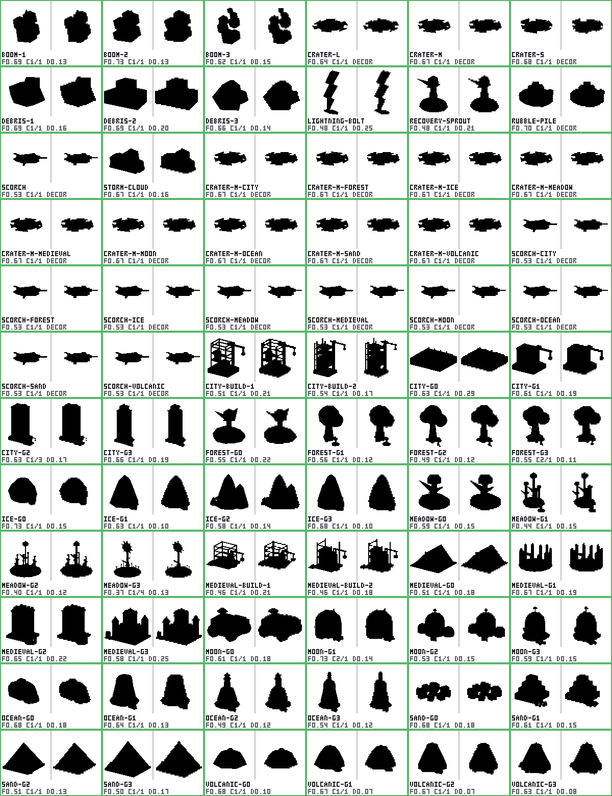
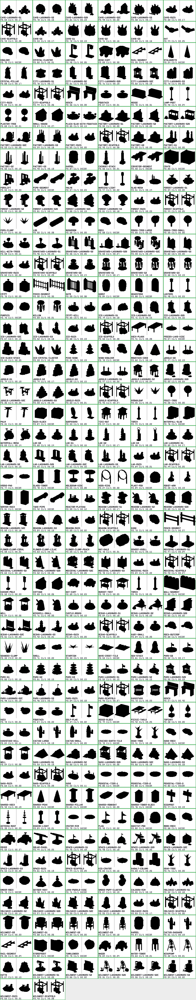

# Asset QA report

Generated 2026-09-19 22:26 EDT by `tools/qa/run_all.sh` (QA Inspector territory). Re-run: `bash tools/qa/run_all.sh`. Rules and thresholds: `tools/qa/README.md`; contract: `.fleet/org.md`.

Verdicts: PASS = every rule in the technical contract holds. FAIL = at least one rule broken (reasons listed). Third-party sets (`cc0`) are measured against the same rules but tagged `third-party` and never block the gate. Silhouette scores come from `silhouette_test.py` (Blender, 3/4 orthographic view, 96 px and 48 px masks). PENDING = the set's manifest or file count changed while the gate ran (a worker is mid-write); its numbers are a snapshot and its failures are not blockers until the next run.

## Asset sets

| Set | Folder | Owner | Files on disk | GLB gate | Silhouettes | Notes |
|---|---|---|---|---|---|---|
| creatures-generated | `assets/creatures/generated` | Creature Artisan | 222 | 222/222 pass | 222/222 pass, 0 samey | static creatures, kind=creature |
| creatures-animated | `assets/creatures/animated` | Animator | 222 | 222/222 pass | 222/222 pass, 0 samey | creatures with idle/walk/happy/sad/sleep clips |
| creatures-cc0 | `assets/creatures/cc0` | Asset Scout | 52 | 0/52 pass (third-party) | 35/52 pass, 0 samey | third-party references (reported, never gate) |
| landmarks | `assets/landmarks` | Landmark Artisan | 278 | 278/278 pass | 278/278 pass, 0 samey | landmark stages/variants, props, terrain (+ v4: ruin, scaffold, hero, shared) |
| growth | `assets/growth` | Growth Artisan | 72 | 72/72 pass | 72/72 pass, 0 samey | growth heroes g0-g3, construction states, catastrophe kit |
| props | `assets/props` | Landmark Artisan / Asset Scout | 0 | - | - | optional: 113 props ship under `assets/landmarks/<biome>/props/` (gated with the landmarks set) |
| audio | `assets/audio` | Sound Artisan | 179 | 179/179 pass | - | 25 wav sounds, peak <= -1 dBFS |

## GLB contract gate (`check_glb.py`)

| Set | Kind | Files | Pass | Fail | Triangles | Height (m) | Textures | Extensions | Clips expected |
|---|---|---|---|---|---|---|---|---|---|
| creatures-animated | creature | 222 | 222 | 0 | 382 - 1500 | 0.700 - 0.900 | 0 | none | idle, walk, happy, sad, sleep |
| creatures-cc0 (third-party) | creature | 52 | 0 | 52 | 240 - 8284 | 0.508 - 510.976 | 49 | KHR_texture_transform | - |
| creatures-generated | creature | 222 | 222 | 0 | 382 - 1500 | 0.700 - 0.900 | 0 | none | - |
| growth | construction, growth, prop | 72 | 72 | 0 | 24 - 2138 | 0.055 - 4.560 | 0 | none | - |
| landmarks | hero, landmark-s1, landmark-s2, landmark-s3, prop, ruin, scaffold, shared, terrain | 278 | 278 | 0 | 18 - 1042 | 0.060 - 4.740 | 0 | none | - |

### creatures-animated

Kinds: creature x222.
Families (16): cave, city, factory, forest, graveyard, ice, jungle, lab, meadow, medieval, ocean, park, sand, space, volcanic, wildwest.
Body/ground contrast (catalogue): 1.41 - 5.94 over 222 creatures (rule >= 1.4).

Manifest `assets/creatures/animated/manifest.json` (written 2026-09-19T22:04:21, generated_at 2026-09-19T22:02:33-04:00); kind/stage/variant, tags and contrast come from it; 0 listed file(s) missing on disk.

Animation rules: clips idle, walk, happy, sad, sleep; durations idle=2.0, walk=0.8, happy=1.2, sad=1.5, sleep=3.0; nodes Root, Body; static Root.

No failures.

| File | Status | Tris | Height | min y | Front z | Mats | Clips | KB | Reasons |
|---|---|---|---|---|---|---|---|---|---|
| `bean-cave-1.glb` | PASS | 1270 | 0.7198 | 0.0 | 0.3879 | 4 | happy,idle,sad,sleep,walk | 89 | - |
| `bean-cave-2.glb` | PASS | 1210 | 0.8766 | 0.0 | 0.4098 | 4 | happy,idle,sad,sleep,walk | 87 | - |
| `bean-city-1.glb` | PASS | 998 | 0.7 | 0.0 | 0.2331 | 4 | happy,idle,sad,sleep,walk | 74 | - |
| `bean-city-2.glb` | PASS | 1054 | 0.7 | 0.0 | 0.3854 | 4 | happy,idle,sad,sleep,walk | 78 | - |
| `bean-factory-1.glb` | PASS | 1204 | 0.8863 | 0.0 | 0.4156 | 5 | happy,idle,sad,sleep,walk | 88 | - |
| `bean-factory-2.glb` | PASS | 1098 | 0.7 | 0.0 | 0.3873 | 4 | happy,idle,sad,sleep,walk | 81 | - |
| `bean-forest-1.glb` | PASS | 1278 | 0.7 | 0.0 | 0.4138 | 4 | happy,idle,sad,sleep,walk | 90 | - |
| `bean-forest-2.glb` | PASS | 912 | 0.7053 | 0.0 | 0.4006 | 4 | happy,idle,sad,sleep,walk | 70 | - |
| `bean-graveyard-1.glb` | PASS | 1116 | 0.7074 | 0.0 | 0.4036 | 5 | happy,idle,sad,sleep,walk | 83 | - |
| `bean-graveyard-2.glb` | PASS | 1016 | 0.7691 | 0.0 | 0.4075 | 4 | happy,idle,sad,sleep,walk | 78 | - |
| `bean-ice-1.glb` | PASS | 1016 | 0.9 | 0.0 | 0.3823 | 4 | happy,idle,sad,sleep,walk | 76 | - |
| `bean-ice-2.glb` | PASS | 1070 | 0.728 | 0.0 | 0.373 | 5 | happy,idle,sad,sleep,walk | 79 | - |
| `bean-jungle-1.glb` | PASS | 832 | 0.7 | 0.0 | 0.3893 | 4 | happy,idle,sad,sleep,walk | 65 | - |
| `bean-jungle-2.glb` | PASS | 1074 | 0.7 | 0.0 | 0.4221 | 4 | happy,idle,sad,sleep,walk | 80 | - |
| `bean-lab-1.glb` | PASS | 1154 | 0.8204 | 0.0 | 0.4453 | 5 | happy,idle,sad,sleep,walk | 85 | - |
| `bean-lab-2.glb` | PASS | 938 | 0.7 | 0.0 | 0.4286 | 5 | happy,idle,sad,sleep,walk | 73 | - |
| `bean-meadow-1.glb` | PASS | 1132 | 0.7493 | 0.0 | 0.4017 | 4 | happy,idle,sad,sleep,walk | 81 | - |
| `bean-meadow-2.glb` | PASS | 868 | 0.7351 | 0.0 | 0.2719 | 4 | happy,idle,sad,sleep,walk | 67 | - |
| `bean-meadow-9218.glb` | PASS | 1078 | 0.7 | 0.0 | 0.378 | 5 | happy,idle,sad,sleep,walk | 82 | - |
| `bean-medieval-1.glb` | PASS | 1266 | 0.7256 | 0.0 | 0.4089 | 5 | happy,idle,sad,sleep,walk | 91 | - |
| `bean-medieval-2.glb` | PASS | 1312 | 0.8299 | 0.0 | 0.3755 | 5 | happy,idle,sad,sleep,walk | 94 | - |
| `bean-ocean-1.glb` | PASS | 870 | 0.809 | 0.0 | 0.383 | 4 | happy,idle,sad,sleep,walk | 69 | - |
| `bean-ocean-2.glb` | PASS | 1116 | 0.7871 | 0.0 | 0.3761 | 5 | happy,idle,sad,sleep,walk | 83 | - |
| `bean-park-1.glb` | PASS | 808 | 0.7 | 0.0 | 0.4684 | 3 | happy,idle,sad,sleep,walk | 63 | - |
| `bean-park-2.glb` | PASS | 1304 | 0.7835 | 0.0 | 0.3919 | 5 | happy,idle,sad,sleep,walk | 93 | - |
| `bean-sand-1.glb` | PASS | 1048 | 0.7729 | 0.0 | 0.4207 | 5 | happy,idle,sad,sleep,walk | 80 | - |
| `bean-sand-2.glb` | PASS | 904 | 0.7 | 0.0 | 0.4185 | 4 | happy,idle,sad,sleep,walk | 70 | - |
| `bean-space-1.glb` | PASS | 1364 | 0.8123 | 0.0 | 0.388 | 5 | happy,idle,sad,sleep,walk | 96 | - |
| `bean-space-2.glb` | PASS | 1040 | 0.7 | 0.0 | 0.3945 | 4 | happy,idle,sad,sleep,walk | 79 | - |
| `bean-volcanic-1.glb` | PASS | 1338 | 0.7 | 0.0 | 0.4145 | 5 | happy,idle,sad,sleep,walk | 96 | - |
| `bean-volcanic-2.glb` | PASS | 1298 | 0.8426 | 0.0 | 0.4004 | 5 | happy,idle,sad,sleep,walk | 94 | - |
| `bean-wildwest-1.glb` | PASS | 1036 | 0.719 | 0.0 | 0.388 | 5 | happy,idle,sad,sleep,walk | 79 | - |
| `bean-wildwest-2.glb` | PASS | 1292 | 0.7 | 0.0 | 0.4508 | 5 | happy,idle,sad,sleep,walk | 93 | - |
| `biped-cave-1.glb` | PASS | 1122 | 0.9 | 0.0 | 0.1712 | 4 | happy,idle,sad,sleep,walk | 85 | - |
| `biped-cave-2.glb` | PASS | 866 | 0.9 | 0.0 | 0.1415 | 4 | happy,idle,sad,sleep,walk | 72 | - |
| `biped-city-1.glb` | PASS | 950 | 0.9 | 0.0 | 0.1449 | 4 | happy,idle,sad,sleep,walk | 75 | - |
| `biped-city-2.glb` | PASS | 986 | 0.9 | 0.0 | 0.1777 | 4 | happy,idle,sad,sleep,walk | 76 | - |
| `biped-factory-1.glb` | PASS | 1376 | 0.9 | 0.0 | 0.2382 | 5 | happy,idle,sad,sleep,walk | 102 | - |
| `biped-factory-2.glb` | PASS | 1186 | 0.9 | 0.0 | 0.187 | 5 | happy,idle,sad,sleep,walk | 90 | - |
| `biped-factory-427.glb` | PASS | 1208 | 0.9 | 0.0 | 0.2167 | 5 | happy,idle,sad,sleep,walk | 92 | - |
| `biped-forest-1.glb` | PASS | 740 | 0.9 | 0.0 | 0.2305 | 4 | happy,idle,sad,sleep,walk | 63 | - |
| `biped-forest-2.glb` | PASS | 622 | 0.9 | 0.0 | 0.1689 | 4 | happy,idle,sad,sleep,walk | 57 | - |
| `biped-forest-8132.glb` | PASS | 736 | 0.9 | 0.0 | 0.1486 | 3 | happy,idle,sad,sleep,walk | 63 | - |
| `biped-graveyard-1.glb` | PASS | 1284 | 0.9 | 0.0 | 0.2361 | 5 | happy,idle,sad,sleep,walk | 96 | - |
| `biped-graveyard-2.glb` | PASS | 1044 | 0.9 | 0.0 | 0.1982 | 4 | happy,idle,sad,sleep,walk | 80 | - |
| `biped-ice-1.glb` | PASS | 896 | 0.9 | 0.0 | 0.1925 | 4 | happy,idle,sad,sleep,walk | 71 | - |
| `biped-ice-2.glb` | PASS | 944 | 0.9 | 0.0 | 0.1927 | 5 | happy,idle,sad,sleep,walk | 76 | - |
| `biped-ice-5796.glb` | PASS | 920 | 0.9 | 0.0 | 0.2246 | 5 | happy,idle,sad,sleep,walk | 73 | - |
| `biped-jungle-1.glb` | PASS | 1308 | 0.9 | 0.0 | 0.1865 | 5 | happy,idle,sad,sleep,walk | 97 | - |
| `biped-jungle-2.glb` | PASS | 934 | 0.9 | 0.0 | 0.1758 | 5 | happy,idle,sad,sleep,walk | 75 | - |
| `biped-lab-1.glb` | PASS | 1192 | 0.9 | 0.0 | 0.1677 | 4 | happy,idle,sad,sleep,walk | 90 | - |
| `biped-lab-2.glb` | PASS | 818 | 0.9 | 0.0 | 0.1769 | 4 | happy,idle,sad,sleep,walk | 69 | - |
| `biped-meadow-1.glb` | PASS | 1024 | 0.9 | 0.0 | 0.1687 | 4 | happy,idle,sad,sleep,walk | 80 | - |
| `biped-meadow-2.glb` | PASS | 862 | 0.9 | 0.0 | 0.1587 | 4 | happy,idle,sad,sleep,walk | 70 | - |
| `biped-medieval-1.glb` | PASS | 956 | 0.9 | 0.0 | 0.1727 | 4 | happy,idle,sad,sleep,walk | 77 | - |
| `biped-medieval-1562.glb` | PASS | 1146 | 0.9 | 0.0 | 0.1846 | 5 | happy,idle,sad,sleep,walk | 86 | - |
| `biped-medieval-2.glb` | PASS | 890 | 0.9 | 0.0 | 0.1919 | 5 | happy,idle,sad,sleep,walk | 73 | - |
| `biped-ocean-1.glb` | PASS | 778 | 0.9 | 0.0 | 0.2054 | 4 | happy,idle,sad,sleep,walk | 66 | - |
| `biped-ocean-2.glb` | PASS | 864 | 0.9 | 0.0 | 0.1604 | 4 | happy,idle,sad,sleep,walk | 70 | - |
| `biped-park-1.glb` | PASS | 1500 | 0.9 | 0.0 | 0.1865 | 5 | happy,idle,sad,sleep,walk | 106 | - |
| `biped-park-2.glb` | PASS | 590 | 0.9 | 0.0 | 0.1815 | 4 | happy,idle,sad,sleep,walk | 55 | - |
| `biped-sand-1.glb` | PASS | 1168 | 0.9 | 0.0 | 0.1674 | 4 | happy,idle,sad,sleep,walk | 89 | - |
| `biped-sand-2.glb` | PASS | 734 | 0.9 | 0.0 | 0.2201 | 4 | happy,idle,sad,sleep,walk | 63 | - |
| `biped-space-1.glb` | PASS | 1076 | 0.9 | 0.0 | 0.1514 | 4 | happy,idle,sad,sleep,walk | 84 | - |
| `biped-space-2.glb` | PASS | 1322 | 0.9 | 0.0 | 0.2294 | 5 | happy,idle,sad,sleep,walk | 98 | - |
| `biped-space-5802.glb` | PASS | 1188 | 0.9 | 0.0 | 0.1665 | 4 | happy,idle,sad,sleep,walk | 90 | - |
| `biped-volcanic-1.glb` | PASS | 1082 | 0.9 | 0.0 | 0.177 | 4 | happy,idle,sad,sleep,walk | 81 | - |
| `biped-volcanic-2.glb` | PASS | 842 | 0.9 | 0.0 | 0.1359 | 4 | happy,idle,sad,sleep,walk | 69 | - |
| `biped-volcanic-9480.glb` | PASS | 1288 | 0.9 | 0.0 | 0.172 | 5 | happy,idle,sad,sleep,walk | 97 | - |
| `biped-wildwest-1.glb` | PASS | 950 | 0.9 | 0.0 | 0.2719 | 5 | happy,idle,sad,sleep,walk | 77 | - |
| `biped-wildwest-2.glb` | PASS | 876 | 0.9 | 0.0 | 0.1678 | 4 | happy,idle,sad,sleep,walk | 71 | - |
| `biped-wildwest-9948.glb` | PASS | 1152 | 0.9 | 0.0 | 0.1847 | 5 | happy,idle,sad,sleep,walk | 86 | - |
| `bird-cave-1.glb` | PASS | 1002 | 0.9 | 0.0 | 0.2435 | 5 | happy,idle,sad,sleep,walk | 79 | - |
| `bird-cave-2.glb` | PASS | 754 | 0.7 | 0.0 | 0.1934 | 4 | happy,idle,sad,sleep,walk | 65 | - |
| `bird-city-1.glb` | PASS | 1164 | 0.9 | 0.0 | 0.3163 | 5 | happy,idle,sad,sleep,walk | 88 | - |
| `bird-city-2.glb` | PASS | 712 | 0.9 | 0.0 | 0.2895 | 4 | happy,idle,sad,sleep,walk | 62 | - |
| `bird-factory-1.glb` | PASS | 1172 | 0.8683 | 0.0 | 0.2891 | 5 | happy,idle,sad,sleep,walk | 89 | - |
| `bird-factory-2.glb` | PASS | 1310 | 0.9 | 0.0 | 0.245 | 4 | happy,idle,sad,sleep,walk | 98 | - |
| `bird-forest-1.glb` | PASS | 1080 | 0.9 | 0.0 | 0.2672 | 5 | happy,idle,sad,sleep,walk | 84 | - |
| `bird-forest-2.glb` | PASS | 766 | 0.8453 | 0.0 | 0.1684 | 4 | happy,idle,sad,sleep,walk | 65 | - |
| `bird-graveyard-1.glb` | PASS | 1250 | 0.9 | 0.0 | 0.2428 | 4 | happy,idle,sad,sleep,walk | 93 | - |
| `bird-graveyard-2.glb` | PASS | 936 | 0.9 | 0.0 | 0.2867 | 5 | happy,idle,sad,sleep,walk | 76 | - |
| `bird-ice-1.glb` | PASS | 574 | 0.7 | 0.0 | 0.1725 | 4 | happy,idle,sad,sleep,walk | 54 | - |
| `bird-ice-2.glb` | PASS | 916 | 0.8676 | 0.0 | 0.2935 | 5 | happy,idle,sad,sleep,walk | 75 | - |
| `bird-jungle-1.glb` | PASS | 1010 | 0.9 | 0.0 | 0.2937 | 4 | happy,idle,sad,sleep,walk | 79 | - |
| `bird-jungle-2.glb` | PASS | 1202 | 0.9 | 0.0 | 0.2776 | 5 | happy,idle,sad,sleep,walk | 91 | - |
| `bird-lab-1.glb` | PASS | 1330 | 0.9 | 0.0 | 0.2553 | 5 | happy,idle,sad,sleep,walk | 98 | - |
| `bird-lab-2.glb` | PASS | 1402 | 0.8575 | 0.0 | 0.3043 | 5 | happy,idle,sad,sleep,walk | 103 | - |
| `bird-lab-2800.glb` | PASS | 1330 | 0.8809 | 0.0 | 0.2412 | 5 | happy,idle,sad,sleep,walk | 98 | - |
| `bird-meadow-1.glb` | PASS | 1280 | 0.9 | 0.0 | 0.3069 | 5 | happy,idle,sad,sleep,walk | 95 | - |
| `bird-meadow-2.glb` | PASS | 986 | 0.7 | 0.0 | 0.181 | 4 | happy,idle,sad,sleep,walk | 78 | - |
| `bird-medieval-1.glb` | PASS | 1410 | 0.9 | 0.0 | 0.2182 | 5 | happy,idle,sad,sleep,walk | 103 | - |
| `bird-medieval-2.glb` | PASS | 872 | 0.7846 | 0.0 | 0.2776 | 4 | happy,idle,sad,sleep,walk | 72 | - |
| `bird-medieval-4412.glb` | PASS | 1274 | 0.9 | 0.0 | 0.24 | 4 | happy,idle,sad,sleep,walk | 94 | - |
| `bird-ocean-1.glb` | PASS | 864 | 0.9 | 0.0 | 0.2723 | 5 | happy,idle,sad,sleep,walk | 72 | - |
| `bird-ocean-2.glb` | PASS | 1024 | 0.9 | 0.0 | 0.2913 | 4 | happy,idle,sad,sleep,walk | 80 | - |
| `bird-park-1.glb` | PASS | 942 | 0.9 | 0.0 | 0.2474 | 4 | happy,idle,sad,sleep,walk | 75 | - |
| `bird-park-2.glb` | PASS | 986 | 0.9 | 0.0 | 0.2314 | 4 | happy,idle,sad,sleep,walk | 78 | - |
| `bird-park-2905.glb` | PASS | 1010 | 0.9 | 0.0 | 0.2477 | 5 | happy,idle,sad,sleep,walk | 81 | - |
| `bird-sand-1.glb` | PASS | 876 | 0.9 | 0.0 | 0.2468 | 4 | happy,idle,sad,sleep,walk | 72 | - |
| `bird-sand-2.glb` | PASS | 1120 | 0.8784 | 0.0 | 0.2789 | 4 | happy,idle,sad,sleep,walk | 85 | - |
| `bird-space-1.glb` | PASS | 894 | 0.9 | 0.0 | 0.2678 | 4 | happy,idle,sad,sleep,walk | 72 | - |
| `bird-space-2.glb` | PASS | 1210 | 0.8574 | 0.0 | 0.2921 | 4 | happy,idle,sad,sleep,walk | 89 | - |
| `bird-volcanic-1.glb` | PASS | 646 | 0.9 | 0.0 | 0.2671 | 4 | happy,idle,sad,sleep,walk | 59 | - |
| `bird-volcanic-2.glb` | PASS | 880 | 0.7 | 0.0 | 0.1875 | 4 | happy,idle,sad,sleep,walk | 73 | - |
| `bird-volcanic-6266.glb` | PASS | 728 | 0.9 | 0.0 | 0.2906 | 4 | happy,idle,sad,sleep,walk | 63 | - |
| `bird-wildwest-1.glb` | PASS | 1082 | 0.9 | 0.0 | 0.2963 | 5 | happy,idle,sad,sleep,walk | 85 | - |
| `bird-wildwest-2.glb` | PASS | 504 | 0.7 | 0.0 | 0.1769 | 4 | happy,idle,sad,sleep,walk | 50 | - |
| `blob-cave-1.glb` | PASS | 926 | 0.8516 | 0.0 | 0.2895 | 4 | happy,idle,sad,sleep,walk | 69 | - |
| `blob-cave-2.glb` | PASS | 736 | 0.7 | 0.0 | 0.2234 | 4 | happy,idle,sad,sleep,walk | 61 | - |
| `blob-cave-2481.glb` | PASS | 696 | 0.9 | 0.0 | 0.2337 | 4 | happy,idle,sad,sleep,walk | 58 | - |
| `blob-city-1.glb` | PASS | 782 | 0.7 | 0.0 | 0.297 | 4 | happy,idle,sad,sleep,walk | 64 | - |
| `blob-city-2.glb` | PASS | 592 | 0.9 | 0.0 | 0.1709 | 4 | happy,idle,sad,sleep,walk | 52 | - |
| `blob-factory-1.glb` | PASS | 1108 | 0.7 | 0.0 | 0.3078 | 5 | happy,idle,sad,sleep,walk | 80 | - |
| `blob-factory-2.glb` | PASS | 1124 | 0.858 | 0.0 | 0.1932 | 5 | happy,idle,sad,sleep,walk | 85 | - |
| `blob-forest-1.glb` | PASS | 592 | 0.9 | 0.0 | 0.2446 | 4 | happy,idle,sad,sleep,walk | 52 | - |
| `blob-forest-2.glb` | PASS | 908 | 0.8125 | 0.0 | 0.2579 | 4 | happy,idle,sad,sleep,walk | 70 | - |
| `blob-graveyard-1.glb` | PASS | 574 | 0.8132 | 0.0 | 0.2566 | 5 | happy,idle,sad,sleep,walk | 52 | - |
| `blob-graveyard-2.glb` | PASS | 880 | 0.815 | 0.0 | 0.2522 | 5 | happy,idle,sad,sleep,walk | 70 | - |
| `blob-graveyard-8728.glb` | PASS | 694 | 0.8934 | 0.0 | 0.2578 | 4 | happy,idle,sad,sleep,walk | 58 | - |
| `blob-graveyard-9455.glb` | PASS | 382 | 0.7588 | 0.0 | 0.2558 | 3 | happy,idle,sad,sleep,walk | 39 | - |
| `blob-ice-1.glb` | PASS | 982 | 0.7937 | 0.0 | 0.1014 | 4 | happy,idle,sad,sleep,walk | 75 | - |
| `blob-ice-1706.glb` | PASS | 584 | 0.9 | 0.0 | 0.2561 | 4 | happy,idle,sad,sleep,walk | 50 | - |
| `blob-ice-2.glb` | PASS | 882 | 0.7169 | 0.0 | 0.2748 | 5 | happy,idle,sad,sleep,walk | 70 | - |
| `blob-ice-8333.glb` | PASS | 792 | 0.9 | 0.0 | 0.2218 | 5 | happy,idle,sad,sleep,walk | 64 | - |
| `blob-jungle-1.glb` | PASS | 406 | 0.8115 | 0.0 | 0.2703 | 3 | happy,idle,sad,sleep,walk | 41 | - |
| `blob-jungle-2.glb` | PASS | 566 | 0.8323 | 0.0 | 0.2363 | 4 | happy,idle,sad,sleep,walk | 50 | - |
| `blob-jungle-5792.glb` | PASS | 988 | 0.7 | 0.0 | 0.2564 | 5 | happy,idle,sad,sleep,walk | 76 | - |
| `blob-lab-1.glb` | PASS | 860 | 0.7 | 0.0 | 0.2749 | 5 | happy,idle,sad,sleep,walk | 68 | - |
| `blob-lab-2.glb` | PASS | 530 | 0.814 | 0.0 | 0.2617 | 4 | happy,idle,sad,sleep,walk | 48 | - |
| `blob-meadow-1.glb` | PASS | 1010 | 0.9 | 0.0 | 0.2305 | 4 | happy,idle,sad,sleep,walk | 77 | - |
| `blob-meadow-1422.glb` | PASS | 888 | 0.7051 | 0.0 | 0.2039 | 4 | happy,idle,sad,sleep,walk | 69 | - |
| `blob-meadow-2.glb` | PASS | 564 | 0.7825 | 0.0 | 0.2149 | 4 | happy,idle,sad,sleep,walk | 50 | - |
| `blob-medieval-1.glb` | PASS | 780 | 0.7259 | 0.0 | 0.2374 | 5 | happy,idle,sad,sleep,walk | 64 | - |
| `blob-medieval-2.glb` | PASS | 1182 | 0.9 | 0.0 | 0.2595 | 4 | happy,idle,sad,sleep,walk | 87 | - |
| `blob-ocean-1.glb` | PASS | 1040 | 0.9 | 0.0 | 0.1823 | 4 | happy,idle,sad,sleep,walk | 78 | - |
| `blob-ocean-2.glb` | PASS | 474 | 0.7 | 0.0 | 0.2902 | 4 | happy,idle,sad,sleep,walk | 45 | - |
| `blob-park-1.glb` | PASS | 716 | 0.9 | 0.0 | 0.2393 | 4 | happy,idle,sad,sleep,walk | 60 | - |
| `blob-park-2.glb` | PASS | 878 | 0.9 | 0.0 | 0.258 | 5 | happy,idle,sad,sleep,walk | 69 | - |
| `blob-sand-1.glb` | PASS | 700 | 0.7 | 0.0 | 0.261 | 4 | happy,idle,sad,sleep,walk | 56 | - |
| `blob-sand-2.glb` | PASS | 720 | 0.8616 | 0.0 | 0.2842 | 5 | happy,idle,sad,sleep,walk | 60 | - |
| `blob-space-1.glb` | PASS | 452 | 0.7 | 0.0 | 0.2937 | 4 | happy,idle,sad,sleep,walk | 44 | - |
| `blob-space-2.glb` | PASS | 784 | 0.8485 | 0.0 | 0.2491 | 5 | happy,idle,sad,sleep,walk | 64 | - |
| `blob-volcanic-1.glb` | PASS | 592 | 0.7 | 0.0 | 0.2994 | 4 | happy,idle,sad,sleep,walk | 52 | - |
| `blob-volcanic-2.glb` | PASS | 936 | 0.8828 | 0.0 | 0.1963 | 5 | happy,idle,sad,sleep,walk | 73 | - |
| `blob-wildwest-1.glb` | PASS | 1046 | 0.9 | 0.0 | 0.2795 | 5 | happy,idle,sad,sleep,walk | 80 | - |
| `blob-wildwest-2.glb` | PASS | 860 | 0.7 | 0.0 | 0.2118 | 5 | happy,idle,sad,sleep,walk | 68 | - |
| `blob-wildwest-8100.glb` | PASS | 780 | 0.7 | 0.0 | 0.3525 | 4 | happy,idle,sad,sleep,walk | 60 | - |
| `flat-cave-1.glb` | PASS | 1260 | 0.7 | 0.0 | 0.1778 | 4 | happy,idle,sad,sleep,walk | 91 | - |
| `flat-cave-2.glb` | PASS | 788 | 0.9 | 0.0 | 0.1593 | 4 | happy,idle,sad,sleep,walk | 64 | - |
| `flat-city-1.glb` | PASS | 640 | 0.7 | 0.0 | 0.1613 | 4 | happy,idle,sad,sleep,walk | 56 | - |
| `flat-city-2.glb` | PASS | 1142 | 0.7 | 0.0 | 0.1592 | 4 | happy,idle,sad,sleep,walk | 85 | - |
| `flat-factory-1.glb` | PASS | 842 | 0.7 | 0.0 | 0.1871 | 5 | happy,idle,sad,sleep,walk | 69 | - |
| `flat-factory-2.glb` | PASS | 1222 | 0.7126 | 0.0 | 0.1867 | 5 | happy,idle,sad,sleep,walk | 90 | - |
| `flat-factory-5587.glb` | PASS | 694 | 0.792 | 0.0 | 0.1567 | 4 | happy,idle,sad,sleep,walk | 59 | - |
| `flat-forest-1.glb` | PASS | 1248 | 0.7072 | 0.0 | 0.1842 | 5 | happy,idle,sad,sleep,walk | 92 | - |
| `flat-forest-2.glb` | PASS | 1210 | 0.7533 | 0.0 | 0.1659 | 4 | happy,idle,sad,sleep,walk | 87 | - |
| `flat-graveyard-1.glb` | PASS | 974 | 0.7 | 0.0 | 0.1939 | 5 | happy,idle,sad,sleep,walk | 76 | - |
| `flat-graveyard-2.glb` | PASS | 782 | 0.7 | 0.0 | 0.1953 | 4 | happy,idle,sad,sleep,walk | 63 | - |
| `flat-ice-1.glb` | PASS | 742 | 0.8343 | 0.0 | 0.1852 | 4 | happy,idle,sad,sleep,walk | 62 | - |
| `flat-ice-2.glb` | PASS | 996 | 0.7 | 0.0 | 0.2243 | 5 | happy,idle,sad,sleep,walk | 78 | - |
| `flat-ice-3544.glb` | PASS | 854 | 0.7 | 0.0 | 0.1646 | 4 | happy,idle,sad,sleep,walk | 66 | - |
| `flat-jungle-1.glb` | PASS | 842 | 0.8423 | 0.0 | 0.1487 | 4 | happy,idle,sad,sleep,walk | 68 | - |
| `flat-jungle-2.glb` | PASS | 862 | 0.7 | 0.0 | 0.1895 | 4 | happy,idle,sad,sleep,walk | 70 | - |
| `flat-lab-1.glb` | PASS | 936 | 0.7 | 0.0 | 0.2075 | 5 | happy,idle,sad,sleep,walk | 74 | - |
| `flat-lab-2.glb` | PASS | 782 | 0.7 | 0.0 | 0.1839 | 4 | happy,idle,sad,sleep,walk | 64 | - |
| `flat-meadow-1.glb` | PASS | 770 | 0.7 | 0.0 | 0.1854 | 4 | happy,idle,sad,sleep,walk | 62 | - |
| `flat-meadow-2.glb` | PASS | 888 | 0.7 | 0.0 | 0.2025 | 5 | happy,idle,sad,sleep,walk | 71 | - |
| `flat-medieval-1.glb` | PASS | 1002 | 0.9 | 0.0 | 0.1607 | 5 | happy,idle,sad,sleep,walk | 78 | - |
| `flat-medieval-2.glb` | PASS | 836 | 0.9 | 0.0 | 0.1355 | 4 | happy,idle,sad,sleep,walk | 68 | - |
| `flat-ocean-1.glb` | PASS | 1334 | 0.7 | 0.0 | 0.1877 | 5 | happy,idle,sad,sleep,walk | 95 | - |
| `flat-ocean-2.glb` | PASS | 854 | 0.8497 | 0.0 | 0.1699 | 5 | happy,idle,sad,sleep,walk | 69 | - |
| `flat-park-1.glb` | PASS | 876 | 0.7 | 0.0 | 0.18 | 4 | happy,idle,sad,sleep,walk | 68 | - |
| `flat-park-2.glb` | PASS | 688 | 0.8924 | 0.0 | 0.1716 | 4 | happy,idle,sad,sleep,walk | 58 | - |
| `flat-park-503.glb` | PASS | 1006 | 0.7 | 0.0 | 0.2079 | 5 | happy,idle,sad,sleep,walk | 76 | - |
| `flat-sand-1.glb` | PASS | 754 | 0.7 | 0.0 | 0.1792 | 4 | happy,idle,sad,sleep,walk | 63 | - |
| `flat-sand-2.glb` | PASS | 1188 | 0.7 | 0.0 | 0.1874 | 5 | happy,idle,sad,sleep,walk | 89 | - |
| `flat-space-1.glb` | PASS | 906 | 0.7 | 0.0 | 0.1758 | 4 | happy,idle,sad,sleep,walk | 70 | - |
| `flat-space-2.glb` | PASS | 782 | 0.7 | 0.0 | 0.1989 | 4 | happy,idle,sad,sleep,walk | 63 | - |
| `flat-space-9953.glb` | PASS | 936 | 0.7 | 0.0 | 0.2059 | 5 | happy,idle,sad,sleep,walk | 74 | - |
| `flat-volcanic-1.glb` | PASS | 1042 | 0.7 | 0.0 | 0.2241 | 5 | happy,idle,sad,sleep,walk | 79 | - |
| `flat-volcanic-2.glb` | PASS | 796 | 0.7 | 0.0 | 0.1925 | 4 | happy,idle,sad,sleep,walk | 66 | - |
| `flat-wildwest-1.glb` | PASS | 866 | 0.7 | 0.0 | 0.1742 | 5 | happy,idle,sad,sleep,walk | 70 | - |
| `flat-wildwest-2.glb` | PASS | 1110 | 0.7 | 0.0 | 0.1684 | 4 | happy,idle,sad,sleep,walk | 82 | - |
| `sprite-cave-1.glb` | PASS | 868 | 0.7 | 0.0 | 0.1902 | 4 | happy,idle,sad,sleep,walk | 69 | - |
| `sprite-cave-2.glb` | PASS | 1072 | 0.7 | 0.0 | 0.2184 | 5 | happy,idle,sad,sleep,walk | 82 | - |
| `sprite-cave-887.glb` | PASS | 920 | 0.7 | 0.0 | 0.2101 | 5 | happy,idle,sad,sleep,walk | 73 | - |
| `sprite-city-1.glb` | PASS | 802 | 0.7 | 0.0 | 0.2234 | 5 | happy,idle,sad,sleep,walk | 66 | - |
| `sprite-city-2.glb` | PASS | 908 | 0.7 | 0.0 | 0.2923 | 5 | happy,idle,sad,sleep,walk | 72 | - |
| `sprite-factory-1.glb` | PASS | 664 | 0.7293 | 0.0 | 0.1607 | 4 | happy,idle,sad,sleep,walk | 57 | - |
| `sprite-factory-2.glb` | PASS | 754 | 0.7 | 0.0 | 0.2084 | 4 | happy,idle,sad,sleep,walk | 63 | - |
| `sprite-forest-1.glb` | PASS | 696 | 0.7 | 0.0 | 0.2388 | 4 | happy,idle,sad,sleep,walk | 60 | - |
| `sprite-forest-2.glb` | PASS | 1172 | 0.7995 | 0.0 | 0.1827 | 4 | happy,idle,sad,sleep,walk | 87 | - |
| `sprite-graveyard-1.glb` | PASS | 718 | 0.7 | 0.0 | 0.1584 | 5 | happy,idle,sad,sleep,walk | 60 | - |
| `sprite-graveyard-2.glb` | PASS | 568 | 0.7 | 0.0 | 0.2137 | 4 | happy,idle,sad,sleep,walk | 51 | - |
| `sprite-ice-1.glb` | PASS | 804 | 0.7 | 0.0 | 0.1754 | 4 | happy,idle,sad,sleep,walk | 66 | - |
| `sprite-ice-2.glb` | PASS | 568 | 0.7092 | 0.0 | 0.2076 | 4 | happy,idle,sad,sleep,walk | 51 | - |
| `sprite-jungle-1.glb` | PASS | 856 | 0.7 | 0.0 | 0.294 | 5 | happy,idle,sad,sleep,walk | 70 | - |
| `sprite-jungle-2.glb` | PASS | 730 | 0.7 | 0.0 | 0.1798 | 5 | happy,idle,sad,sleep,walk | 61 | - |
| `sprite-jungle-5050.glb` | PASS | 904 | 0.7 | 0.0 | 0.1972 | 4 | happy,idle,sad,sleep,walk | 72 | - |
| `sprite-lab-1.glb` | PASS | 664 | 0.7054 | 0.0 | 0.1538 | 4 | happy,idle,sad,sleep,walk | 57 | - |
| `sprite-lab-2.glb` | PASS | 652 | 0.7 | 0.0 | 0.1612 | 4 | happy,idle,sad,sleep,walk | 56 | - |
| `sprite-lab-6129.glb` | PASS | 868 | 0.7 | 0.0 | 0.2069 | 4 | happy,idle,sad,sleep,walk | 69 | - |
| `sprite-meadow-1.glb` | PASS | 880 | 0.7 | 0.0 | 0.2057 | 4 | happy,idle,sad,sleep,walk | 70 | - |
| `sprite-meadow-2.glb` | PASS | 816 | 0.7 | 0.0 | 0.1823 | 4 | happy,idle,sad,sleep,walk | 67 | - |
| `sprite-medieval-1.glb` | PASS | 964 | 0.7 | 0.0 | 0.2125 | 5 | happy,idle,sad,sleep,walk | 76 | - |
| `sprite-medieval-2.glb` | PASS | 1040 | 0.7 | 0.0 | 0.2306 | 5 | happy,idle,sad,sleep,walk | 80 | - |
| `sprite-ocean-1.glb` | PASS | 960 | 0.7 | 0.0 | 0.2302 | 5 | happy,idle,sad,sleep,walk | 75 | - |
| `sprite-ocean-1781.glb` | PASS | 808 | 0.7 | 0.0 | 0.2317 | 5 | happy,idle,sad,sleep,walk | 65 | - |
| `sprite-ocean-2.glb` | PASS | 926 | 0.7 | 0.0 | 0.223 | 5 | happy,idle,sad,sleep,walk | 73 | - |
| `sprite-park-1.glb` | PASS | 544 | 0.7019 | 0.0 | 0.2085 | 4 | happy,idle,sad,sleep,walk | 50 | - |
| `sprite-park-2.glb` | PASS | 878 | 0.7 | 0.0 | 0.1718 | 5 | happy,idle,sad,sleep,walk | 70 | - |
| `sprite-sand-1.glb` | PASS | 688 | 0.7318 | 0.0 | 0.1652 | 4 | happy,idle,sad,sleep,walk | 59 | - |
| `sprite-sand-2.glb` | PASS | 816 | 0.7 | 0.0 | 0.1915 | 4 | happy,idle,sad,sleep,walk | 67 | - |
| `sprite-sand-4031.glb` | PASS | 824 | 0.7 | 0.0 | 0.1801 | 5 | happy,idle,sad,sleep,walk | 68 | - |
| `sprite-space-1.glb` | PASS | 878 | 0.7 | 0.0 | 0.1963 | 5 | happy,idle,sad,sleep,walk | 69 | - |
| `sprite-space-2.glb` | PASS | 812 | 0.7 | 0.0 | 0.1901 | 5 | happy,idle,sad,sleep,walk | 66 | - |
| `sprite-volcanic-1.glb` | PASS | 906 | 0.7 | 0.0 | 0.2327 | 4 | happy,idle,sad,sleep,walk | 73 | - |
| `sprite-volcanic-2.glb` | PASS | 704 | 0.7 | 0.0 | 0.243 | 5 | happy,idle,sad,sleep,walk | 60 | - |
| `sprite-volcanic-8142.glb` | PASS | 908 | 0.7638 | 0.0 | 0.2118 | 5 | happy,idle,sad,sleep,walk | 72 | - |
| `sprite-wildwest-1.glb` | PASS | 758 | 0.7 | 0.0 | 0.2765 | 4 | happy,idle,sad,sleep,walk | 61 | - |
| `sprite-wildwest-2.glb` | PASS | 916 | 0.7096 | 0.0 | 0.215 | 4 | happy,idle,sad,sleep,walk | 72 | - |

### creatures-cc0 (third-party, reported only)

Kinds: creature x52.

Worst offenders:

- `animal-fish.glb`: glTF extension(s) used: KHR_texture_transform (contract: none); uses textures (1 textured material(s), 1 image(s)); contract: flat baseColorFactor only; min y = +0.104 m (feet/base must sit on y = 0 within +-0.005); height 1.628 m outside 0.69-0.91 for creature
- `Bat.glb`: uses textures (1 textured material(s), 1 image(s)); contract: flat baseColorFactor only; min y = -4.752 m (feet/base must sit on y = 0 within +-0.005); height 510.976 m outside 0.69-0.91 for creature
- `Bee.glb`: uses textures (1 textured material(s), 1 image(s)); contract: flat baseColorFactor only; min y = -0.048 m (feet/base must sit on y = 0 within +-0.005); height 3.863 m outside 0.69-0.91 for creature
- `Corgi.glb`: uses textures (1 textured material(s), 1 image(s)); contract: flat baseColorFactor only; min y = -4.752 m (feet/base must sit on y = 0 within +-0.005); height 404.373 m outside 0.69-0.91 for creature
- `Duck.glb`: uses textures (1 textured material(s), 1 image(s)); contract: flat baseColorFactor only; min y = -1.055 m (feet/base must sit on y = 0 within +-0.005); height 436.575 m outside 0.69-0.91 for creature

Most common warnings: non-canonical clip name (52); front heuristic n/a (50); roughness 1.00-1.00 outside ~0.6 band (40); metallicFactor up to 0.40 (5); largest extent 678.9 (1).

| File | Tris | Height | min y | Textures | Extensions | Clips | KB |
|---|---|---|---|---|---|---|---|
| `Bat.glb` | 376 | 510.9759 | -4.7519 | yes | - | 4 | 94 |
| `Bee.glb` | 328 | 3.8632 | -0.0475 | yes | - | 4 | 153 |
| `Blue.glb` | 384 | 4.1932 | 0.0035 | yes | - | 4 | 161 |
| `Corgi.glb` | 508 | 404.3729 | -4.7519 | yes | - | 4 | 104 |
| `Duck.glb` | 508 | 436.5747 | -1.0549 | yes | - | 4 | 101 |
| `Fugu.glb` | 256 | 2.9187 | 0.5075 | yes | - | 4 | 148 |
| `Goat.glb` | 396 | 4.5859 | -0.0475 | yes | - | 4 | 162 |
| `Hippo.glb` | 382 | 374.7438 | -4.7519 | yes | - | 4 | 97 |
| `Jellyfish.glb` | 428 | 374.7437 | -4.7518 | yes | - | 4 | 98 |
| `Marmot.glb` | 370 | 3.5038 | -0.0475 | yes | - | 4 | 162 |
| `Owl.glb` | 310 | 3.6532 | 0.0008 | yes | - | 4 | 153 |
| `Platypus.glb` | 504 | 342.5104 | 0.2682 | yes | - | 4 | 105 |
| `Rat.glb` | 308 | 3.6658 | 0.0006 | yes | - | 4 | 151 |
| `Red.glb` | 470 | 374.7438 | -4.7519 | yes | - | 4 | 107 |
| `Seal.glb` | 398 | 3.1262 | 0.0266 | yes | - | 4 | 161 |
| `minion-a01.glb` | 240 | 0.616 | -0.366 | yes | - | 3 | 184 |
| `minion-a02.glb` | 240 | 0.5578 | -0.366 | yes | - | 3 | 184 |
| `minion-b01.glb` | 240 | 0.5567 | -0.3761 | yes | - | 3 | 187 |
| `minion-b02.glb` | 240 | 0.5868 | -0.3761 | yes | - | 3 | 187 |
| `minion-c01.glb` | 240 | 0.6111 | -0.366 | yes | - | 3 | 165 |
| `minion-c02.glb` | 240 | 0.5734 | -0.366 | yes | - | 3 | 165 |
| `minion-d01.glb` | 240 | 0.5076 | -0.366 | yes | - | 3 | 202 |
| `minion-d02.glb` | 240 | 0.5607 | -0.366 | yes | - | 3 | 202 |
| `animal-beaver.glb` | 670 | 1.5012 | -0.0 | yes | KHR_texture_transform | 8 | 146 |
| `animal-bee.glb` | 742 | 1.9988 | -0.0 | yes | KHR_texture_transform | 8 | 160 |
| `animal-bunny.glb` | 575 | 2.01 | -0.0 | yes | KHR_texture_transform | 8 | 128 |
| `animal-cat.glb` | 684 | 1.71 | -0.0 | yes | KHR_texture_transform | 8 | 161 |
| `animal-caterpillar.glb` | 578 | 1.7466 | -0.0 | yes | KHR_texture_transform | 8 | 127 |
| `animal-chick.glb` | 490 | 1.5942 | -0.0 | yes | KHR_texture_transform | 8 | 122 |
| `animal-cow.glb` | 578 | 1.6124 | -0.0 | yes | KHR_texture_transform | 8 | 125 |
| `animal-crab.glb` | 676 | 1.4312 | -0.0 | yes | KHR_texture_transform | 8 | 147 |
| `animal-deer.glb` | 760 | 1.9928 | -0.0 | yes | KHR_texture_transform | 8 | 146 |
| `animal-dog.glb` | 490 | 1.5844 | -0.0 | yes | KHR_texture_transform | 8 | 116 |
| `animal-elephant.glb` | 676 | 1.4312 | -0.0 | yes | KHR_texture_transform | 8 | 145 |
| `animal-fish.glb` | 422 | 1.6279 | 0.1042 | yes | KHR_texture_transform | 8 | 89 |
| `animal-fox.glb` | 568 | 1.6863 | -0.0 | yes | KHR_texture_transform | 8 | 138 |
| `animal-giraffe.glb` | 598 | 1.7138 | -0.0 | yes | KHR_texture_transform | 8 | 129 |
| `animal-hog.glb` | 706 | 1.5158 | -0.0 | yes | KHR_texture_transform | 8 | 138 |
| `animal-koala.glb` | 594 | 1.4628 | -0.0 | yes | KHR_texture_transform | 8 | 127 |
| `animal-lion.glb` | 889 | 1.7458 | -0.0 | yes | KHR_texture_transform | 8 | 168 |
| `animal-monkey.glb` | 918 | 1.61 | -0.0 | yes | KHR_texture_transform | 8 | 170 |
| `animal-panda.glb` | 734 | 1.5012 | -0.0 | yes | KHR_texture_transform | 8 | 130 |
| `animal-parrot.glb` | 530 | 1.6812 | -0.0 | yes | KHR_texture_transform | 8 | 150 |
| `animal-penguin.glb` | 558 | 1.5942 | -0.0 | yes | KHR_texture_transform | 8 | 127 |
| `animal-pig.glb` | 424 | 1.5844 | -0.0 | yes | KHR_texture_transform | 8 | 124 |
| `animal-polar.glb` | 522 | 1.5012 | -0.0 | yes | KHR_texture_transform | 8 | 96 |
| `animal-tiger.glb` | 951 | 1.71 | -0.0 | yes | KHR_texture_transform | 8 | 168 |
| `Bunny.glb` | 8284 | 3.442 | -0.1915 | no | - | 14 | 525 |
| `Chick.glb` | 1924 | 1.0425 | 0.0024 | yes | - | 5 | 153 |
| `Frog.glb` | 4920 | 1.4329 | -0.0332 | no | - | 4 | 573 |
| `Hedgehog.glb` | 1472 | 1.0234 | 0.0084 | yes | - | 3 | 105 |
| `ShibaInu.glb` | 1950 | 3.0889 | 0.0044 | no | - | 24 | 831 |

### creatures-generated

Kinds: creature x222.
Families (16): cave, city, factory, forest, graveyard, ice, jungle, lab, meadow, medieval, ocean, park, sand, space, volcanic, wildwest.
Body/ground contrast (catalogue): 1.41 - 5.94 over 222 creatures (rule >= 1.4).

Manifest `assets/creatures/generated/manifest.json` (written 2026-09-19T21:59:35, generated_at 2026-09-19T21:59:35-04:00); kind/stage/variant, tags and contrast come from it; 0 listed file(s) missing on disk.

No failures.

| File | Status | Tris | Height | min y | Front z | Mats | Clips | KB | Reasons |
|---|---|---|---|---|---|---|---|---|---|
| `bean-cave-1.glb` | PASS | 1270 | 0.7198 | 0.0 | 0.3879 | 4 | - | 73 | - |
| `bean-cave-2.glb` | PASS | 1210 | 0.8766 | 0.0 | 0.4098 | 4 | - | 71 | - |
| `bean-city-1.glb` | PASS | 998 | 0.7 | 0.0 | 0.242 | 4 | - | 58 | - |
| `bean-city-2.glb` | PASS | 1054 | 0.7 | 0.0 | 0.3854 | 4 | - | 62 | - |
| `bean-factory-1.glb` | PASS | 1204 | 0.8863 | 0.0 | 0.4156 | 5 | - | 72 | - |
| `bean-factory-2.glb` | PASS | 1098 | 0.7 | 0.0 | 0.3874 | 4 | - | 65 | - |
| `bean-forest-1.glb` | PASS | 1278 | 0.7 | 0.0 | 0.4127 | 4 | - | 73 | - |
| `bean-forest-2.glb` | PASS | 912 | 0.7053 | 0.0 | 0.4005 | 4 | - | 53 | - |
| `bean-graveyard-1.glb` | PASS | 1116 | 0.7074 | 0.0 | 0.4036 | 5 | - | 67 | - |
| `bean-graveyard-2.glb` | PASS | 1016 | 0.7691 | 0.0 | 0.4071 | 4 | - | 61 | - |
| `bean-ice-1.glb` | PASS | 1016 | 0.9 | 0.0 | 0.3823 | 4 | - | 60 | - |
| `bean-ice-2.glb` | PASS | 1070 | 0.728 | 0.0 | 0.373 | 5 | - | 62 | - |
| `bean-jungle-1.glb` | PASS | 832 | 0.7 | 0.0 | 0.3893 | 4 | - | 48 | - |
| `bean-jungle-2.glb` | PASS | 1074 | 0.7 | 0.0 | 0.4221 | 4 | - | 63 | - |
| `bean-lab-1.glb` | PASS | 1154 | 0.8204 | 0.0 | 0.4453 | 5 | - | 69 | - |
| `bean-lab-2.glb` | PASS | 938 | 0.7 | 0.0 | 0.4286 | 5 | - | 57 | - |
| `bean-meadow-1.glb` | PASS | 1132 | 0.7493 | 0.0 | 0.4017 | 4 | - | 65 | - |
| `bean-meadow-2.glb` | PASS | 868 | 0.7351 | 0.0 | 0.2831 | 4 | - | 51 | - |
| `bean-meadow-9218.glb` | PASS | 1078 | 0.7 | 0.0 | 0.378 | 5 | - | 65 | - |
| `bean-medieval-1.glb` | PASS | 1266 | 0.7256 | 0.0 | 0.4089 | 5 | - | 74 | - |
| `bean-medieval-2.glb` | PASS | 1312 | 0.8299 | 0.0 | 0.3755 | 5 | - | 78 | - |
| `bean-ocean-1.glb` | PASS | 870 | 0.809 | 0.0 | 0.383 | 4 | - | 52 | - |
| `bean-ocean-2.glb` | PASS | 1116 | 0.7871 | 0.0 | 0.3761 | 5 | - | 66 | - |
| `bean-park-1.glb` | PASS | 808 | 0.7 | 0.0 | 0.4684 | 3 | - | 46 | - |
| `bean-park-2.glb` | PASS | 1304 | 0.7835 | 0.0 | 0.3919 | 5 | - | 77 | - |
| `bean-sand-1.glb` | PASS | 1048 | 0.7729 | 0.0 | 0.4207 | 5 | - | 63 | - |
| `bean-sand-2.glb` | PASS | 904 | 0.7 | 0.0 | 0.4185 | 4 | - | 53 | - |
| `bean-space-1.glb` | PASS | 1364 | 0.8123 | 0.0 | 0.388 | 5 | - | 80 | - |
| `bean-space-2.glb` | PASS | 1040 | 0.7 | 0.0 | 0.3945 | 4 | - | 62 | - |
| `bean-volcanic-1.glb` | PASS | 1338 | 0.7 | 0.0 | 0.4145 | 5 | - | 79 | - |
| `bean-volcanic-2.glb` | PASS | 1298 | 0.8426 | 0.0 | 0.4004 | 5 | - | 76 | - |
| `bean-wildwest-1.glb` | PASS | 1036 | 0.719 | 0.0 | 0.388 | 5 | - | 63 | - |
| `bean-wildwest-2.glb` | PASS | 1292 | 0.7 | 0.0 | 0.4508 | 5 | - | 76 | - |
| `biped-cave-1.glb` | PASS | 1122 | 0.9 | 0.0 | 0.1712 | 4 | - | 69 | - |
| `biped-cave-2.glb` | PASS | 866 | 0.9 | 0.0 | 0.141 | 4 | - | 55 | - |
| `biped-city-1.glb` | PASS | 950 | 0.9 | 0.0 | 0.1449 | 4 | - | 59 | - |
| `biped-city-2.glb` | PASS | 986 | 0.9 | 0.0 | 0.1777 | 4 | - | 60 | - |
| `biped-factory-1.glb` | PASS | 1376 | 0.9 | 0.0 | 0.2382 | 5 | - | 85 | - |
| `biped-factory-2.glb` | PASS | 1186 | 0.9 | 0.0 | 0.187 | 5 | - | 74 | - |
| `biped-factory-427.glb` | PASS | 1208 | 0.9 | 0.0 | 0.2167 | 5 | - | 75 | - |
| `biped-forest-1.glb` | PASS | 740 | 0.9 | 0.0 | 0.2305 | 4 | - | 47 | - |
| `biped-forest-2.glb` | PASS | 622 | 0.9 | 0.0 | 0.1689 | 4 | - | 41 | - |
| `biped-forest-8132.glb` | PASS | 736 | 0.9 | 0.0 | 0.1486 | 3 | - | 46 | - |
| `biped-graveyard-1.glb` | PASS | 1284 | 0.9 | 0.0 | 0.2361 | 5 | - | 79 | - |
| `biped-graveyard-2.glb` | PASS | 1044 | 0.9 | 0.0 | 0.1979 | 4 | - | 63 | - |
| `biped-ice-1.glb` | PASS | 896 | 0.9 | 0.0 | 0.1925 | 4 | - | 54 | - |
| `biped-ice-2.glb` | PASS | 944 | 0.9 | 0.0 | 0.1927 | 5 | - | 60 | - |
| `biped-ice-5796.glb` | PASS | 920 | 0.9 | 0.0 | 0.2246 | 5 | - | 56 | - |
| `biped-jungle-1.glb` | PASS | 1308 | 0.9 | 0.0 | 0.1865 | 5 | - | 80 | - |
| `biped-jungle-2.glb` | PASS | 934 | 0.9 | 0.0 | 0.1758 | 5 | - | 59 | - |
| `biped-lab-1.glb` | PASS | 1192 | 0.9 | 0.0 | 0.1677 | 4 | - | 73 | - |
| `biped-lab-2.glb` | PASS | 818 | 0.9 | 0.0 | 0.1766 | 4 | - | 52 | - |
| `biped-meadow-1.glb` | PASS | 1024 | 0.9 | 0.0 | 0.1677 | 4 | - | 64 | - |
| `biped-meadow-2.glb` | PASS | 862 | 0.9 | 0.0 | 0.1587 | 4 | - | 54 | - |
| `biped-medieval-1.glb` | PASS | 956 | 0.9 | 0.0 | 0.1727 | 4 | - | 60 | - |
| `biped-medieval-1562.glb` | PASS | 1146 | 0.9 | 0.0 | 0.1846 | 5 | - | 70 | - |
| `biped-medieval-2.glb` | PASS | 890 | 0.9 | 0.0 | 0.1919 | 5 | - | 56 | - |
| `biped-ocean-1.glb` | PASS | 778 | 0.9 | 0.0 | 0.2048 | 4 | - | 49 | - |
| `biped-ocean-2.glb` | PASS | 864 | 0.9 | 0.0 | 0.1604 | 4 | - | 54 | - |
| `biped-park-1.glb` | PASS | 1500 | 0.9 | 0.0 | 0.1865 | 5 | - | 90 | - |
| `biped-park-2.glb` | PASS | 590 | 0.9 | 0.0 | 0.1815 | 4 | - | 39 | - |
| `biped-sand-1.glb` | PASS | 1168 | 0.9 | 0.0 | 0.1667 | 4 | - | 72 | - |
| `biped-sand-2.glb` | PASS | 734 | 0.9 | 0.0 | 0.2201 | 4 | - | 47 | - |
| `biped-space-1.glb` | PASS | 1076 | 0.9 | 0.0 | 0.1514 | 4 | - | 67 | - |
| `biped-space-2.glb` | PASS | 1322 | 0.9 | 0.0 | 0.2294 | 5 | - | 82 | - |
| `biped-space-5802.glb` | PASS | 1188 | 0.9 | 0.0 | 0.1665 | 4 | - | 73 | - |
| `biped-volcanic-1.glb` | PASS | 1082 | 0.9 | 0.0 | 0.177 | 4 | - | 65 | - |
| `biped-volcanic-2.glb` | PASS | 842 | 0.9 | 0.0 | 0.1359 | 4 | - | 53 | - |
| `biped-volcanic-9480.glb` | PASS | 1288 | 0.9 | 0.0 | 0.172 | 5 | - | 79 | - |
| `biped-wildwest-1.glb` | PASS | 950 | 0.9 | 0.0 | 0.2716 | 5 | - | 60 | - |
| `biped-wildwest-2.glb` | PASS | 876 | 0.9 | 0.0 | 0.1678 | 4 | - | 55 | - |
| `biped-wildwest-9948.glb` | PASS | 1152 | 0.9 | 0.0 | 0.1847 | 5 | - | 70 | - |
| `bird-cave-1.glb` | PASS | 1002 | 0.9 | 0.0 | 0.2435 | 5 | - | 62 | - |
| `bird-cave-2.glb` | PASS | 754 | 0.7 | 0.0 | 0.1934 | 4 | - | 49 | - |
| `bird-city-1.glb` | PASS | 1164 | 0.9 | 0.0 | 0.3163 | 5 | - | 71 | - |
| `bird-city-2.glb` | PASS | 712 | 0.9 | 0.0 | 0.2895 | 4 | - | 45 | - |
| `bird-factory-1.glb` | PASS | 1172 | 0.8683 | 0.0 | 0.2891 | 5 | - | 72 | - |
| `bird-factory-2.glb` | PASS | 1310 | 0.9 | 0.0 | 0.245 | 4 | - | 81 | - |
| `bird-forest-1.glb` | PASS | 1080 | 0.9 | 0.0 | 0.2672 | 5 | - | 67 | - |
| `bird-forest-2.glb` | PASS | 766 | 0.8453 | 0.0 | 0.1672 | 4 | - | 49 | - |
| `bird-graveyard-1.glb` | PASS | 1250 | 0.9 | 0.0 | 0.2408 | 4 | - | 76 | - |
| `bird-graveyard-2.glb` | PASS | 936 | 0.9 | 0.0 | 0.2867 | 5 | - | 59 | - |
| `bird-ice-1.glb` | PASS | 574 | 0.7 | 0.0 | 0.1725 | 4 | - | 37 | - |
| `bird-ice-2.glb` | PASS | 916 | 0.8676 | 0.0 | 0.2928 | 5 | - | 58 | - |
| `bird-jungle-1.glb` | PASS | 1010 | 0.9 | 0.0 | 0.2937 | 4 | - | 62 | - |
| `bird-jungle-2.glb` | PASS | 1202 | 0.9 | 0.0 | 0.2776 | 5 | - | 74 | - |
| `bird-lab-1.glb` | PASS | 1330 | 0.9 | 0.0 | 0.2553 | 5 | - | 81 | - |
| `bird-lab-2.glb` | PASS | 1402 | 0.8575 | 0.0 | 0.3043 | 5 | - | 86 | - |
| `bird-lab-2800.glb` | PASS | 1330 | 0.8809 | 0.0 | 0.2412 | 5 | - | 82 | - |
| `bird-meadow-1.glb` | PASS | 1280 | 0.9 | 0.0 | 0.3069 | 5 | - | 79 | - |
| `bird-meadow-2.glb` | PASS | 986 | 0.7 | 0.0 | 0.181 | 4 | - | 61 | - |
| `bird-medieval-1.glb` | PASS | 1410 | 0.9 | 0.0 | 0.2182 | 5 | - | 86 | - |
| `bird-medieval-2.glb` | PASS | 872 | 0.7846 | 0.0 | 0.2776 | 4 | - | 55 | - |
| `bird-medieval-4412.glb` | PASS | 1274 | 0.9 | 0.0 | 0.24 | 4 | - | 77 | - |
| `bird-ocean-1.glb` | PASS | 864 | 0.9 | 0.0 | 0.2723 | 5 | - | 55 | - |
| `bird-ocean-2.glb` | PASS | 1024 | 0.9 | 0.0 | 0.2913 | 4 | - | 63 | - |
| `bird-park-1.glb` | PASS | 942 | 0.9 | 0.0 | 0.2474 | 4 | - | 59 | - |
| `bird-park-2.glb` | PASS | 986 | 0.9 | 0.0 | 0.2314 | 4 | - | 61 | - |
| `bird-park-2905.glb` | PASS | 1010 | 0.9 | 0.0 | 0.2477 | 5 | - | 64 | - |
| `bird-sand-1.glb` | PASS | 876 | 0.9 | 0.0 | 0.2468 | 4 | - | 55 | - |
| `bird-sand-2.glb` | PASS | 1120 | 0.8784 | 0.0 | 0.2789 | 4 | - | 69 | - |
| `bird-space-1.glb` | PASS | 894 | 0.9 | 0.0 | 0.2673 | 4 | - | 56 | - |
| `bird-space-2.glb` | PASS | 1210 | 0.8574 | 0.0 | 0.2882 | 4 | - | 72 | - |
| `bird-volcanic-1.glb` | PASS | 646 | 0.9 | 0.0 | 0.264 | 4 | - | 42 | - |
| `bird-volcanic-2.glb` | PASS | 880 | 0.7 | 0.0 | 0.1853 | 4 | - | 56 | - |
| `bird-volcanic-6266.glb` | PASS | 728 | 0.9 | 0.0 | 0.2906 | 4 | - | 46 | - |
| `bird-wildwest-1.glb` | PASS | 1082 | 0.9 | 0.0 | 0.2963 | 5 | - | 68 | - |
| `bird-wildwest-2.glb` | PASS | 504 | 0.7 | 0.0 | 0.1769 | 4 | - | 34 | - |
| `blob-cave-1.glb` | PASS | 926 | 0.8516 | 0.0 | 0.2895 | 4 | - | 53 | - |
| `blob-cave-2.glb` | PASS | 736 | 0.7 | 0.0 | 0.2234 | 4 | - | 44 | - |
| `blob-cave-2481.glb` | PASS | 696 | 0.9 | 0.0 | 0.2337 | 4 | - | 42 | - |
| `blob-city-1.glb` | PASS | 782 | 0.7 | 0.0 | 0.2956 | 4 | - | 48 | - |
| `blob-city-2.glb` | PASS | 592 | 0.9 | 0.0 | 0.1709 | 4 | - | 36 | - |
| `blob-factory-1.glb` | PASS | 1108 | 0.7 | 0.0 | 0.3078 | 5 | - | 64 | - |
| `blob-factory-2.glb` | PASS | 1124 | 0.858 | 0.0 | 0.1932 | 5 | - | 67 | - |
| `blob-forest-1.glb` | PASS | 592 | 0.9 | 0.0 | 0.2446 | 4 | - | 35 | - |
| `blob-forest-2.glb` | PASS | 908 | 0.8125 | 0.0 | 0.2575 | 4 | - | 54 | - |
| `blob-graveyard-1.glb` | PASS | 574 | 0.8132 | 0.0 | 0.2566 | 5 | - | 36 | - |
| `blob-graveyard-2.glb` | PASS | 880 | 0.815 | 0.0 | 0.2522 | 5 | - | 54 | - |
| `blob-graveyard-8728.glb` | PASS | 694 | 0.8934 | 0.0 | 0.2578 | 4 | - | 42 | - |
| `blob-graveyard-9455.glb` | PASS | 382 | 0.7588 | 0.0 | 0.2558 | 3 | - | 23 | - |
| `blob-ice-1.glb` | PASS | 982 | 0.7937 | 0.0 | 0.1166 | 4 | - | 58 | - |
| `blob-ice-1706.glb` | PASS | 584 | 0.9 | 0.0 | 0.2561 | 4 | - | 33 | - |
| `blob-ice-2.glb` | PASS | 882 | 0.7169 | 0.0 | 0.2748 | 5 | - | 54 | - |
| `blob-ice-8333.glb` | PASS | 792 | 0.9 | 0.0 | 0.2218 | 5 | - | 47 | - |
| `blob-jungle-1.glb` | PASS | 406 | 0.8115 | 0.0 | 0.2703 | 3 | - | 24 | - |
| `blob-jungle-2.glb` | PASS | 566 | 0.8323 | 0.0 | 0.2363 | 4 | - | 35 | - |
| `blob-jungle-5792.glb` | PASS | 988 | 0.7 | 0.0 | 0.2564 | 5 | - | 60 | - |
| `blob-lab-1.glb` | PASS | 860 | 0.7 | 0.0 | 0.2749 | 5 | - | 52 | - |
| `blob-lab-2.glb` | PASS | 530 | 0.814 | 0.0 | 0.2617 | 4 | - | 32 | - |
| `blob-meadow-1.glb` | PASS | 1010 | 0.9 | 0.0 | 0.2305 | 4 | - | 60 | - |
| `blob-meadow-1422.glb` | PASS | 888 | 0.7051 | 0.0 | 0.2039 | 4 | - | 52 | - |
| `blob-meadow-2.glb` | PASS | 564 | 0.7825 | 0.0 | 0.2149 | 4 | - | 34 | - |
| `blob-medieval-1.glb` | PASS | 780 | 0.7259 | 0.0 | 0.2374 | 5 | - | 48 | - |
| `blob-medieval-2.glb` | PASS | 1182 | 0.9 | 0.0 | 0.259 | 4 | - | 70 | - |
| `blob-ocean-1.glb` | PASS | 1040 | 0.9 | 0.0 | 0.1823 | 4 | - | 61 | - |
| `blob-ocean-2.glb` | PASS | 474 | 0.7 | 0.0 | 0.2891 | 4 | - | 29 | - |
| `blob-park-1.glb` | PASS | 716 | 0.9 | 0.0 | 0.2393 | 4 | - | 43 | - |
| `blob-park-2.glb` | PASS | 878 | 0.9 | 0.0 | 0.258 | 5 | - | 53 | - |
| `blob-sand-1.glb` | PASS | 700 | 0.7 | 0.0 | 0.261 | 4 | - | 40 | - |
| `blob-sand-2.glb` | PASS | 720 | 0.8616 | 0.0 | 0.2842 | 5 | - | 44 | - |
| `blob-space-1.glb` | PASS | 452 | 0.7 | 0.0 | 0.2934 | 4 | - | 27 | - |
| `blob-space-2.glb` | PASS | 784 | 0.8485 | 0.0 | 0.2491 | 5 | - | 47 | - |
| `blob-volcanic-1.glb` | PASS | 592 | 0.7 | 0.0 | 0.2984 | 4 | - | 36 | - |
| `blob-volcanic-2.glb` | PASS | 936 | 0.8828 | 0.0 | 0.1963 | 5 | - | 56 | - |
| `blob-wildwest-1.glb` | PASS | 1046 | 0.9 | 0.0 | 0.2795 | 5 | - | 63 | - |
| `blob-wildwest-2.glb` | PASS | 860 | 0.7 | 0.0 | 0.2118 | 5 | - | 52 | - |
| `blob-wildwest-8100.glb` | PASS | 780 | 0.7 | 0.0 | 0.3525 | 4 | - | 45 | - |
| `flat-cave-1.glb` | PASS | 1260 | 0.7 | 0.0 | 0.1779 | 4 | - | 73 | - |
| `flat-cave-2.glb` | PASS | 788 | 0.9 | 0.0 | 0.1593 | 4 | - | 47 | - |
| `flat-city-1.glb` | PASS | 640 | 0.7 | 0.0 | 0.1607 | 4 | - | 39 | - |
| `flat-city-2.glb` | PASS | 1142 | 0.7 | 0.0 | 0.1592 | 4 | - | 69 | - |
| `flat-factory-1.glb` | PASS | 842 | 0.7 | 0.0 | 0.1871 | 5 | - | 52 | - |
| `flat-factory-2.glb` | PASS | 1222 | 0.7126 | 0.0 | 0.1867 | 5 | - | 73 | - |
| `flat-factory-5587.glb` | PASS | 694 | 0.792 | 0.0 | 0.1567 | 4 | - | 42 | - |
| `flat-forest-1.glb` | PASS | 1248 | 0.7072 | 0.0 | 0.1842 | 5 | - | 75 | - |
| `flat-forest-2.glb` | PASS | 1210 | 0.7533 | 0.0 | 0.1659 | 4 | - | 70 | - |
| `flat-graveyard-1.glb` | PASS | 974 | 0.7 | 0.0 | 0.1939 | 5 | - | 60 | - |
| `flat-graveyard-2.glb` | PASS | 782 | 0.7 | 0.0 | 0.1954 | 4 | - | 46 | - |
| `flat-ice-1.glb` | PASS | 742 | 0.8343 | 0.0 | 0.1843 | 4 | - | 45 | - |
| `flat-ice-2.glb` | PASS | 996 | 0.7 | 0.0 | 0.2243 | 5 | - | 61 | - |
| `flat-ice-3544.glb` | PASS | 854 | 0.7 | 0.0 | 0.1646 | 4 | - | 50 | - |
| `flat-jungle-1.glb` | PASS | 842 | 0.8423 | 0.0 | 0.1487 | 4 | - | 51 | - |
| `flat-jungle-2.glb` | PASS | 862 | 0.7 | 0.0 | 0.1895 | 4 | - | 53 | - |
| `flat-lab-1.glb` | PASS | 936 | 0.7 | 0.0 | 0.2079 | 5 | - | 57 | - |
| `flat-lab-2.glb` | PASS | 782 | 0.7 | 0.0 | 0.1834 | 4 | - | 47 | - |
| `flat-meadow-1.glb` | PASS | 770 | 0.7 | 0.0 | 0.1853 | 4 | - | 45 | - |
| `flat-meadow-2.glb` | PASS | 888 | 0.7 | 0.0 | 0.2025 | 5 | - | 54 | - |
| `flat-medieval-1.glb` | PASS | 1002 | 0.9 | 0.0 | 0.1607 | 5 | - | 61 | - |
| `flat-medieval-2.glb` | PASS | 836 | 0.9 | 0.0 | 0.1355 | 4 | - | 50 | - |
| `flat-ocean-1.glb` | PASS | 1334 | 0.7 | 0.0 | 0.1877 | 5 | - | 78 | - |
| `flat-ocean-2.glb` | PASS | 854 | 0.8497 | 0.0 | 0.1699 | 5 | - | 52 | - |
| `flat-park-1.glb` | PASS | 876 | 0.7 | 0.0 | 0.18 | 4 | - | 51 | - |
| `flat-park-2.glb` | PASS | 688 | 0.8924 | 0.0 | 0.1719 | 4 | - | 42 | - |
| `flat-park-503.glb` | PASS | 1006 | 0.7 | 0.0 | 0.2079 | 5 | - | 59 | - |
| `flat-sand-1.glb` | PASS | 754 | 0.7 | 0.0 | 0.1792 | 4 | - | 46 | - |
| `flat-sand-2.glb` | PASS | 1188 | 0.7 | 0.0 | 0.1874 | 5 | - | 72 | - |
| `flat-space-1.glb` | PASS | 906 | 0.7 | 0.0 | 0.1758 | 4 | - | 53 | - |
| `flat-space-2.glb` | PASS | 782 | 0.7 | 0.0 | 0.1989 | 4 | - | 46 | - |
| `flat-space-9953.glb` | PASS | 936 | 0.7 | 0.0 | 0.2059 | 5 | - | 57 | - |
| `flat-volcanic-1.glb` | PASS | 1042 | 0.7 | 0.0 | 0.2241 | 5 | - | 61 | - |
| `flat-volcanic-2.glb` | PASS | 796 | 0.7 | 0.0 | 0.1925 | 4 | - | 48 | - |
| `flat-wildwest-1.glb` | PASS | 866 | 0.7 | 0.0 | 0.1742 | 5 | - | 53 | - |
| `flat-wildwest-2.glb` | PASS | 1110 | 0.7 | 0.0 | 0.1677 | 4 | - | 65 | - |
| `sprite-cave-1.glb` | PASS | 868 | 0.7 | 0.0 | 0.1902 | 4 | - | 53 | - |
| `sprite-cave-2.glb` | PASS | 1072 | 0.7 | 0.0 | 0.2184 | 5 | - | 65 | - |
| `sprite-cave-887.glb` | PASS | 920 | 0.7 | 0.0 | 0.2101 | 5 | - | 57 | - |
| `sprite-city-1.glb` | PASS | 802 | 0.7 | 0.0 | 0.2234 | 5 | - | 49 | - |
| `sprite-city-2.glb` | PASS | 908 | 0.7 | 0.0 | 0.2923 | 5 | - | 56 | - |
| `sprite-factory-1.glb` | PASS | 664 | 0.7293 | 0.0 | 0.1607 | 4 | - | 41 | - |
| `sprite-factory-2.glb` | PASS | 754 | 0.7 | 0.0 | 0.2082 | 4 | - | 46 | - |
| `sprite-forest-1.glb` | PASS | 696 | 0.7 | 0.0 | 0.2388 | 4 | - | 43 | - |
| `sprite-forest-2.glb` | PASS | 1172 | 0.7995 | 0.0 | 0.1827 | 4 | - | 71 | - |
| `sprite-graveyard-1.glb` | PASS | 718 | 0.7 | 0.0 | 0.1578 | 5 | - | 43 | - |
| `sprite-graveyard-2.glb` | PASS | 568 | 0.7 | 0.0 | 0.2137 | 4 | - | 35 | - |
| `sprite-ice-1.glb` | PASS | 804 | 0.7 | 0.0 | 0.1751 | 4 | - | 49 | - |
| `sprite-ice-2.glb` | PASS | 568 | 0.7092 | 0.0 | 0.2076 | 4 | - | 35 | - |
| `sprite-jungle-1.glb` | PASS | 856 | 0.7 | 0.0 | 0.294 | 5 | - | 53 | - |
| `sprite-jungle-2.glb` | PASS | 730 | 0.7 | 0.0 | 0.1798 | 5 | - | 44 | - |
| `sprite-jungle-5050.glb` | PASS | 904 | 0.7 | 0.0 | 0.1972 | 4 | - | 55 | - |
| `sprite-lab-1.glb` | PASS | 664 | 0.7054 | 0.0 | 0.1538 | 4 | - | 41 | - |
| `sprite-lab-2.glb` | PASS | 652 | 0.7 | 0.0 | 0.1612 | 4 | - | 40 | - |
| `sprite-lab-6129.glb` | PASS | 868 | 0.7 | 0.0 | 0.2069 | 4 | - | 53 | - |
| `sprite-meadow-1.glb` | PASS | 880 | 0.7 | 0.0 | 0.2057 | 4 | - | 53 | - |
| `sprite-meadow-2.glb` | PASS | 816 | 0.7 | 0.0 | 0.1823 | 4 | - | 50 | - |
| `sprite-medieval-1.glb` | PASS | 964 | 0.7 | 0.0 | 0.2125 | 5 | - | 59 | - |
| `sprite-medieval-2.glb` | PASS | 1040 | 0.7 | 0.0 | 0.2306 | 5 | - | 63 | - |
| `sprite-ocean-1.glb` | PASS | 960 | 0.7 | 0.0 | 0.2302 | 5 | - | 59 | - |
| `sprite-ocean-1781.glb` | PASS | 808 | 0.7 | 0.0 | 0.2319 | 5 | - | 49 | - |
| `sprite-ocean-2.glb` | PASS | 926 | 0.7 | 0.0 | 0.223 | 5 | - | 56 | - |
| `sprite-park-1.glb` | PASS | 544 | 0.7019 | 0.0 | 0.2083 | 4 | - | 34 | - |
| `sprite-park-2.glb` | PASS | 878 | 0.7 | 0.0 | 0.1718 | 5 | - | 53 | - |
| `sprite-sand-1.glb` | PASS | 688 | 0.7318 | 0.0 | 0.1652 | 4 | - | 42 | - |
| `sprite-sand-2.glb` | PASS | 816 | 0.7 | 0.0 | 0.1915 | 4 | - | 50 | - |
| `sprite-sand-4031.glb` | PASS | 824 | 0.7 | 0.0 | 0.1801 | 5 | - | 51 | - |
| `sprite-space-1.glb` | PASS | 878 | 0.7 | 0.0 | 0.1963 | 5 | - | 53 | - |
| `sprite-space-2.glb` | PASS | 812 | 0.7 | 0.0 | 0.1901 | 5 | - | 50 | - |
| `sprite-volcanic-1.glb` | PASS | 906 | 0.7 | 0.0 | 0.2327 | 4 | - | 56 | - |
| `sprite-volcanic-2.glb` | PASS | 704 | 0.7 | 0.0 | 0.243 | 5 | - | 44 | - |
| `sprite-volcanic-8142.glb` | PASS | 908 | 0.7638 | 0.0 | 0.2118 | 5 | - | 56 | - |
| `sprite-wildwest-1.glb` | PASS | 758 | 0.7 | 0.0 | 0.2765 | 4 | - | 45 | - |
| `sprite-wildwest-2.glb` | PASS | 916 | 0.7096 | 0.0 | 0.2153 | 4 | - | 56 | - |

### growth

Kinds: construction x4, growth stage 0 x9, growth stage 1 x9, growth stage 2 x9, growth stage 3 x9, prop x32.
Families (10): any, city, forest, ice, meadow, medieval, ocean, sand, space, volcanic.

Manifest `assets/growth/manifest.json` (written 2026-09-19T21:51:31, generated_at 2026-09-19T21:51:31-04:00); kind/stage/variant, tags and contrast come from it; 0 listed file(s) missing on disk.

No failures.

Most common warnings: 1 material (11).

| File | Status | Tris | Height | min y | Front z | Mats | Clips | KB | Reasons |
|---|---|---|---|---|---|---|---|---|---|
| `boom-1.glb` | PASS | 106 | 0.77 | 0.0 | n/a | 4 | - | 11 | - |
| `boom-2.glb` | PASS | 164 | 1.412 | 0.0 | n/a | 4 | - | 15 | - |
| `boom-3.glb` | PASS | 140 | 1.4021 | 0.0 | n/a | 2 | - | 12 | - |
| `crater-l.glb` | PASS | 244 | 0.1651 | 0.0 | -0.12 | 3 | - | 14 | - |
| `crater-m.glb` | PASS | 244 | 0.1032 | 0.0 | -0.01 | 3 | - | 14 | - |
| `crater-s.glb` | PASS | 244 | 0.0827 | 0.0 | -0.0148 | 3 | - | 14 | - |
| `debris-1.glb` | PASS | 32 | 0.3803 | 0.0 | 0.0499 | 2 | - | 3 | - |
| `debris-2.glb` | PASS | 24 | 0.3 | 0.0 | 0.0 | 2 | - | 2 | - |
| `debris-3.glb` | PASS | 40 | 0.4063 | 0.0 | -0.1554 | 2 | - | 4 | - |
| `lightning-bolt.glb` | PASS | 60 | 1.1 | 0.0 | n/a | 1 | - | 3 | - |
| `recovery-sprout.glb` | PASS | 164 | 0.57 | 0.0 | 0.0013 | 5 | - | 14 | - |
| `rubble-pile.glb` | PASS | 176 | 0.52 | 0.0 | -0.006 | 3 | - | 13 | - |
| `scorch.glb` | PASS | 148 | 0.055 | 0.0 | -0.038 | 2 | - | 8 | - |
| `storm-cloud.glb` | PASS | 112 | 0.6577 | 0.0 | 0.0079 | 1 | - | 9 | - |
| `crater-m-city.glb` | PASS | 244 | 0.1032 | 0.0 | -0.01 | 3 | - | 14 | - |
| `crater-m-forest.glb` | PASS | 244 | 0.1032 | 0.0 | -0.01 | 3 | - | 14 | - |
| `crater-m-ice.glb` | PASS | 244 | 0.1032 | 0.0 | -0.01 | 3 | - | 14 | - |
| `crater-m-meadow.glb` | PASS | 244 | 0.1032 | 0.0 | -0.01 | 3 | - | 14 | - |
| `crater-m-medieval.glb` | PASS | 244 | 0.1032 | 0.0 | n/a | 3 | - | 14 | - |
| `crater-m-moon.glb` | PASS | 244 | 0.1032 | 0.0 | -0.01 | 3 | - | 14 | - |
| `crater-m-ocean.glb` | PASS | 244 | 0.1032 | 0.0 | -0.01 | 3 | - | 14 | - |
| `crater-m-sand.glb` | PASS | 244 | 0.1032 | 0.0 | -0.01 | 3 | - | 14 | - |
| `crater-m-volcanic.glb` | PASS | 244 | 0.1032 | 0.0 | -0.01 | 3 | - | 14 | - |
| `scorch-city.glb` | PASS | 148 | 0.055 | 0.0 | -0.038 | 2 | - | 8 | - |
| `scorch-forest.glb` | PASS | 148 | 0.055 | 0.0 | -0.038 | 2 | - | 8 | - |
| `scorch-ice.glb` | PASS | 148 | 0.055 | 0.0 | -0.038 | 2 | - | 8 | - |
| `scorch-meadow.glb` | PASS | 148 | 0.055 | 0.0 | -0.038 | 2 | - | 8 | - |
| `scorch-medieval.glb` | PASS | 148 | 0.055 | 0.0 | -0.038 | 2 | - | 8 | - |
| `scorch-moon.glb` | PASS | 148 | 0.055 | 0.0 | -0.038 | 2 | - | 8 | - |
| `scorch-ocean.glb` | PASS | 148 | 0.055 | 0.0 | -0.038 | 2 | - | 8 | - |
| `scorch-sand.glb` | PASS | 148 | 0.055 | 0.0 | -0.038 | 2 | - | 8 | - |
| `scorch-volcanic.glb` | PASS | 148 | 0.055 | 0.0 | -0.038 | 2 | - | 8 | - |
| `city-build-1.glb` | PASS | 504 | 1.74 | 0.0 | 0.1 | 6 | - | 31 | - |
| `city-build-2.glb` | PASS | 612 | 2.71 | 0.0 | 0.0375 | 8 | - | 38 | - |
| `city-g0.glb` | PASS | 132 | 0.44 | 0.0 | 0.38 | 4 | - | 9 | - |
| `city-g1.glb` | PASS | 348 | 1.29 | 0.0 | 0.1 | 9 | - | 24 | - |
| `city-g2.glb` | PASS | 840 | 2.63 | 0.0 | -0.2 | 9 | - | 50 | - |
| `city-g3.glb` | PASS | 2138 | 4.525 | 0.0 | 0.6525 | 10 | - | 120 | - |
| `forest-g0.glb` | PASS | 134 | 0.45 | 0.0 | -0.0071 | 3 | - | 11 | - |
| `forest-g1.glb` | PASS | 448 | 1.2287 | 0.0 | n/a | 4 | - | 34 | - |
| `forest-g2.glb` | PASS | 888 | 2.6263 | 0.0 | 0.2206 | 5 | - | 65 | - |
| `forest-g3.glb` | PASS | 1552 | 4.5455 | 0.0 | 0.9463 | 6 | - | 110 | - |
| `ice-g0.glb` | PASS | 180 | 0.4368 | 0.0 | n/a | 3 | - | 15 | - |
| `ice-g1.glb` | PASS | 244 | 1.2 | 0.0 | n/a | 3 | - | 18 | - |
| `ice-g2.glb` | PASS | 466 | 2.6 | 0.0 | n/a | 3 | - | 32 | - |
| `ice-g3.glb` | PASS | 884 | 4.5213 | 0.0 | n/a | 3 | - | 59 | - |
| `meadow-g0.glb` | PASS | 128 | 0.4 | 0.0 | n/a | 3 | - | 11 | - |
| `meadow-g1.glb` | PASS | 448 | 1.203 | 0.0 | n/a | 6 | - | 33 | - |
| `meadow-g2.glb` | PASS | 1076 | 2.586 | 0.0 | n/a | 7 | - | 70 | - |
| `meadow-g3.glb` | PASS | 1894 | 4.5 | 0.0 | 0.31 | 8 | - | 118 | - |
| `medieval-build-1.glb` | PASS | 388 | 1.7 | 0.0 | n/a | 7 | - | 25 | - |
| `medieval-build-2.glb` | PASS | 376 | 2.4 | 0.0 | n/a | 8 | - | 26 | - |
| `medieval-g0.glb` | PASS | 56 | 0.42 | 0.0 | n/a | 5 | - | 6 | - |
| `medieval-g1.glb` | PASS | 412 | 1.18 | 0.0 | n/a | 6 | - | 26 | - |
| `medieval-g2.glb` | PASS | 700 | 2.6 | 0.0 | n/a | 8 | - | 43 | - |
| `medieval-g3.glb` | PASS | 1586 | 4.56 | 0.0 | n/a | 8 | - | 89 | - |
| `moon-g0.glb` | PASS | 180 | 0.44 | 0.0 | 0.0133 | 4 | - | 11 | - |
| `moon-g1.glb` | PASS | 344 | 1.2 | 0.0 | 0.685 | 7 | - | 23 | - |
| `moon-g2.glb` | PASS | 704 | 2.6 | 0.0 | 1.1953 | 7 | - | 44 | - |
| `moon-g3.glb` | PASS | 1036 | 4.5 | 0.0 | 0.605 | 7 | - | 61 | - |
| `ocean-g0.glb` | PASS | 240 | 0.3994 | 0.0 | n/a | 2 | - | 19 | - |
| `ocean-g1.glb` | PASS | 452 | 1.2404 | 0.0 | n/a | 3 | - | 32 | - |
| `ocean-g2.glb` | PASS | 886 | 2.705 | 0.0 | 0.0788 | 7 | - | 57 | - |
| `ocean-g3.glb` | PASS | 1500 | 4.455 | 0.0 | 0.2514 | 7 | - | 94 | - |
| `sand-g0.glb` | PASS | 120 | 0.42 | 0.0 | n/a | 3 | - | 8 | - |
| `sand-g1.glb` | PASS | 228 | 1.2 | 0.0 | 0.13 | 6 | - | 16 | - |
| `sand-g2.glb` | PASS | 276 | 2.62 | 0.0 | 1.27 | 6 | - | 19 | - |
| `sand-g3.glb` | PASS | 354 | 4.5 | 0.0 | 2.1918 | 6 | - | 23 | - |
| `volcanic-g0.glb` | PASS | 188 | 0.4234 | 0.0 | -0.0336 | 3 | - | 13 | - |
| `volcanic-g1.glb` | PASS | 376 | 1.2161 | 0.0 | -0.0823 | 3 | - | 24 | - |
| `volcanic-g2.glb` | PASS | 854 | 2.6095 | 0.0 | -0.1849 | 4 | - | 54 | - |
| `volcanic-g3.glb` | PASS | 1484 | 4.4624 | 0.0 | 0.9721 | 5 | - | 93 | - |

### landmarks

Kinds: hero stage 0 x7, hero stage 1 x7, hero stage 2 x7, hero stage 3 x7, landmark-s1 stage 1 x16, landmark-s2 stage 2 x48, landmark-s3 stage 3 x16, prop x113, ruin stage 2 x16, scaffold x16, shared x9, terrain x16.
Families (17): cave, city, factory, forest, graveyard, ice, jungle, lab, meadow, medieval, ocean, park, sand, shared, space, volcanic, wildwest.

Manifest `assets/landmarks/manifest.json` (written 2026-09-19T22:24:42, generated_at 2026-09-19T22:24:42-04:00); kind/stage/variant, tags and contrast come from it; 0 listed file(s) missing on disk.

No failures.

Most common warnings: 1 material (80).

| File | Status | Tris | Height | min y | Front z | Mats | Clips | KB | Reasons |
|---|---|---|---|---|---|---|---|---|---|
| `cave-landmark-s1.glb` | PASS | 192 | 0.5876 | 0.0 | -0.005 | 4 | - | 15 | - |
| `cave-landmark-s2.glb` | PASS | 382 | 0.9666 | 0.0 | 0.3748 | 7 | - | 29 | - |
| `cave-landmark-s2b.glb` | PASS | 340 | 0.9975 | 0.0 | 0.08 | 6 | - | 25 | - |
| `cave-landmark-s2c.glb` | PASS | 634 | 0.98 | 0.0 | 0.1962 | 7 | - | 41 | - |
| `cave-landmark-s3.glb` | PASS | 572 | 1.8064 | 0.0 | 0.4923 | 8 | - | 41 | - |
| `cave-ruin.glb` | PASS | 490 | 0.7194 | 0.0 | 0.2389 | 8 | - | 37 | - |
| `cave-scaffold.glb` | PASS | 324 | 1.0 | 0.0 | 0.0505 | 6 | - | 23 | - |
| `cave-g0.glb` | PASS | 192 | 0.4466 | 0.0 | -0.0038 | 4 | - | 15 | - |
| `cave-g1.glb` | PASS | 232 | 1.2598 | 0.0 | 0.4871 | 4 | - | 18 | - |
| `cave-g2.glb` | PASS | 400 | 2.5939 | 0.0 | 0.6604 | 6 | - | 28 | - |
| `cave-g3.glb` | PASS | 400 | 4.4863 | 0.0 | 0.8991 | 6 | - | 28 | - |
| `bat.glb` | PASS | 60 | 0.141 | 0.0 | 0.0 | 2 | - | 4 | - |
| `boulder.glb` | PASS | 160 | 0.429 | 0.0 | 0.0045 | 1 | - | 13 | - |
| `crystal-cluster.glb` | PASS | 160 | 0.5846 | 0.0 | -0.0726 | 3 | - | 13 | - |
| `lantern.glb` | PASS | 66 | 0.545 | 0.0 | 0.0 | 3 | - | 5 | - |
| `mine-cart.glb` | PASS | 284 | 0.3611 | 0.0 | 0.0 | 3 | - | 18 | - |
| `rail-segment.glb` | PASS | 60 | 0.07 | 0.0 | 0.0 | 2 | - | 4 | - |
| `stalagmite.glb` | PASS | 18 | 0.7 | 0.0 | 0.0314 | 1 | - | 2 | - |
| `crystal-pillar.glb` | PASS | 268 | 2.8721 | 0.0 | 0.5753 | 6 | - | 21 | - |
| `city-landmark-s1.glb` | PASS | 106 | 0.61 | 0.0 | 0.0 | 6 | - | 10 | - |
| `city-landmark-s2.glb` | PASS | 284 | 1.05 | 0.0 | 0.0748 | 8 | - | 21 | - |
| `city-landmark-s2b.glb` | PASS | 262 | 1.0 | 0.0 | 0.1471 | 8 | - | 20 | - |
| `city-landmark-s2c.glb` | PASS | 376 | 1.035 | 0.0 | 0.0623 | 8 | - | 26 | - |
| `city-landmark-s3.glb` | PASS | 542 | 1.81 | 0.0 | 0.025 | 7 | - | 35 | - |
| `city-ruin.glb` | PASS | 404 | 0.7221 | 0.0 | -0.1255 | 8 | - | 31 | - |
| `city-scaffold.glb` | PASS | 238 | 1.0 | 0.0 | 0.05 | 7 | - | 18 | - |
| `bench.glb` | PASS | 60 | 0.675 | 0.0 | 0.0 | 3 | - | 5 | - |
| `fountain.glb` | PASS | 292 | 0.555 | 0.0 | n/a | 4 | - | 17 | - |
| `hedge.glb` | PASS | 68 | 0.41 | 0.0 | n/a | 3 | - | 6 | - |
| `lamp-post.glb` | PASS | 114 | 1.36 | 0.0 | 0.0 | 4 | - | 9 | - |
| `planter-tree.glb` | PASS | 120 | 1.0289 | 0.0 | -0.0 | 4 | - | 11 | - |
| `small-house.glb` | PASS | 80 | 0.7 | 0.0 | -0.09 | 5 | - | 8 | - |
| `plaza-slab-with-fountain.glb` | PASS | 924 | 1.6075 | 0.0 | 0.95 | 8 | - | 60 | - |
| `factory-landmark-s1.glb` | PASS | 204 | 0.6192 | 0.0 | 0.0 | 4 | - | 13 | - |
| `factory-landmark-s2.glb` | PASS | 524 | 1.0526 | 0.0 | 0.211 | 6 | - | 33 | - |
| `factory-landmark-s2b.glb` | PASS | 584 | 0.91 | 0.0 | 0.0906 | 4 | - | 33 | - |
| `factory-landmark-s2c.glb` | PASS | 676 | 1.1073 | 0.0 | 0.2265 | 5 | - | 40 | - |
| `factory-landmark-s3.glb` | PASS | 890 | 1.8231 | 0.0 | -0.0226 | 7 | - | 57 | - |
| `factory-ruin.glb` | PASS | 502 | 0.7194 | 0.0 | -0.0128 | 6 | - | 34 | - |
| `factory-scaffold.glb` | PASS | 336 | 1.0 | 0.0 | 0.05 | 6 | - | 22 | - |
| `factory-g0.glb` | PASS | 204 | 0.4644 | 0.0 | 0.0 | 4 | - | 13 | - |
| `factory-g1.glb` | PASS | 432 | 1.2043 | 0.0 | 0.0 | 6 | - | 30 | - |
| `factory-g2.glb` | PASS | 556 | 2.6757 | 0.0 | 0.0 | 6 | - | 38 | - |
| `factory-g3.glb` | PASS | 848 | 4.6472 | 0.0 | 0.0 | 6 | - | 54 | - |
| `barrel.glb` | PASS | 116 | 0.34 | 0.0 | 0.0 | 2 | - | 7 | - |
| `chimney-stack.glb` | PASS | 164 | 1.2407 | 0.0 | 0.0 | 4 | - | 13 | - |
| `conveyor-segment.glb` | PASS | 96 | 0.36 | 0.0 | 0.0 | 3 | - | 7 | - |
| `crate.glb` | PASS | 36 | 0.36 | 0.0 | 0.0 | 2 | - | 3 | - |
| `forklift.glb` | PASS | 288 | 0.79 | 0.0 | -0.1732 | 3 | - | 16 | - |
| `pipe-segment.glb` | PASS | 108 | 0.25 | 0.0 | 0.0 | 3 | - | 7 | - |
| `valve.glb` | PASS | 180 | 0.37 | 0.0 | 0.0 | 4 | - | 12 | - |
| `warning-light.glb` | PASS | 82 | 0.62 | 0.0 | 0.0 | 3 | - | 6 | - |
| `slag-mesa.glb` | PASS | 408 | 2.1058 | 0.0 | n/a | 6 | - | 28 | - |
| `forest-landmark-s1.glb` | PASS | 178 | 0.5949 | 0.0 | -0.0 | 4 | - | 13 | - |
| `forest-landmark-s2.glb` | PASS | 566 | 1.05 | 0.0 | 0.0144 | 6 | - | 39 | - |
| `forest-landmark-s2b.glb` | PASS | 338 | 1.01 | 0.0 | 0.0656 | 6 | - | 23 | - |
| `forest-landmark-s2c.glb` | PASS | 400 | 1.0 | 0.0 | 0.1616 | 6 | - | 25 | - |
| `forest-landmark-s3.glb` | PASS | 696 | 1.7981 | 0.0 | 0.2445 | 6 | - | 50 | - |
| `forest-ruin.glb` | PASS | 476 | 0.7194 | 0.0 | 0.0488 | 9 | - | 35 | - |
| `forest-scaffold.glb` | PASS | 310 | 1.0 | 0.0 | -0.0143 | 5 | - | 20 | - |
| `fern-clump.glb` | PASS | 48 | 0.3004 | 0.0 | -0.0179 | 2 | - | 5 | - |
| `log.glb` | PASS | 40 | 0.3036 | 0.0 | -0.0237 | 1 | - | 2 | - |
| `mushroom.glb` | PASS | 154 | 0.4 | 0.0 | n/a | 3 | - | 12 | - |
| `rock.glb` | PASS | 160 | 0.3652 | 0.0 | n/a | 1 | - | 13 | - |
| `round-tree-large.glb` | PASS | 176 | 1.31 | 0.0 | n/a | 3 | - | 15 | - |
| `round-tree-small.glb` | PASS | 96 | 0.7834 | 0.0 | n/a | 2 | - | 8 | - |
| `hill-with-trees.glb` | PASS | 528 | 1.9882 | 0.0 | n/a | 4 | - | 41 | - |
| `graveyard-landmark-s1.glb` | PASS | 134 | 0.61 | 0.0 | 0.0 | 4 | - | 10 | - |
| `graveyard-landmark-s2.glb` | PASS | 352 | 0.934 | 0.0 | -0.0924 | 5 | - | 22 | - |
| `graveyard-landmark-s2b.glb` | PASS | 344 | 0.94 | 0.0 | 0.1034 | 5 | - | 23 | - |
| `graveyard-landmark-s2c.glb` | PASS | 420 | 0.943 | 0.0 | 0.009 | 6 | - | 28 | - |
| `graveyard-landmark-s3.glb` | PASS | 396 | 1.81 | 0.0 | 0.0861 | 5 | - | 26 | - |
| `graveyard-ruin.glb` | PASS | 432 | 0.7194 | 0.0 | 0.0151 | 7 | - | 31 | - |
| `graveyard-scaffold.glb` | PASS | 266 | 1.0 | 0.0 | 0.05 | 6 | - | 18 | - |
| `graveyard-g0.glb` | PASS | 224 | 0.4159 | 0.0 | n/a | 3 | - | 15 | - |
| `graveyard-g1.glb` | PASS | 224 | 1.109 | 0.0 | n/a | 3 | - | 15 | - |
| `graveyard-g2.glb` | PASS | 392 | 2.4029 | 0.0 | 0.0 | 5 | - | 26 | - |
| `graveyard-g3.glb` | PASS | 552 | 4.1588 | 0.0 | 0.0 | 6 | - | 39 | - |
| `crypt.glb` | PASS | 96 | 0.69 | 0.0 | 0.0633 | 3 | - | 8 | - |
| `fence-segment.glb` | PASS | 108 | 0.5 | 0.0 | 0.0 | 1 | - | 6 | - |
| `gate.glb` | PASS | 136 | 0.69 | 0.0 | 0.0 | 3 | - | 10 | - |
| `ghost.glb` | PASS | 140 | 0.5937 | 0.0 | 0.18 | 2 | - | 11 | - |
| `headstone.glb` | PASS | 52 | 0.444 | 0.0 | 0.035 | 2 | - | 4 | - |
| `lantern.glb` | PASS | 62 | 0.704 | 0.0 | 0.0 | 3 | - | 5 | - |
| `pumpkin.glb` | PASS | 100 | 0.33 | 0.0 | -0.0 | 3 | - | 8 | - |
| `willow.glb` | PASS | 196 | 1.0373 | 0.0 | n/a | 2 | - | 13 | - |
| `crypt-hill.glb` | PASS | 578 | 1.9402 | 0.0 | 0.1515 | 6 | - | 38 | - |
| `ice-landmark-s1.glb` | PASS | 96 | 0.61 | 0.0 | 0.62 | 3 | - | 8 | - |
| `ice-landmark-s2.glb` | PASS | 252 | 1.05 | 0.0 | 0.1938 | 4 | - | 18 | - |
| `ice-landmark-s2b.glb` | PASS | 218 | 1.04 | 0.0 | -0.0569 | 6 | - | 16 | - |
| `ice-landmark-s2c.glb` | PASS | 202 | 1.02 | 0.0 | 0.33 | 4 | - | 15 | - |
| `ice-landmark-s3.glb` | PASS | 566 | 1.8055 | 0.0 | 0.2265 | 5 | - | 36 | - |
| `ice-ruin.glb` | PASS | 394 | 0.7194 | 0.0 | 0.1468 | 7 | - | 30 | - |
| `ice-scaffold.glb` | PASS | 228 | 1.0 | 0.0 | 0.458 | 6 | - | 17 | - |
| `dock-plank.glb` | PASS | 108 | 0.29 | 0.0 | 0.0 | 2 | - | 7 | - |
| `frozen-lake-disc.glb` | PASS | 180 | 0.5418 | 0.0 | n/a | 4 | - | 12 | - |
| `ice-block-stack.glb` | PASS | 60 | 0.685 | 0.0 | n/a | 3 | - | 5 | - |
| `ice-crystal-cluster.glb` | PASS | 180 | 0.6185 | 0.0 | n/a | 3 | - | 14 | - |
| `pine-snow.glb` | PASS | 80 | 1.22 | 0.0 | n/a | 3 | - | 7 | - |
| `snow-boulder.glb` | PASS | 240 | 0.5925 | 0.0 | n/a | 2 | - | 20 | - |
| `mountain-cone.glb` | PASS | 78 | 2.1 | 0.0 | n/a | 2 | - | 5 | - |
| `jungle-g0.glb` | PASS | 140 | 0.4425 | 0.0 | -0.0 | 6 | - | 12 | - |
| `jungle-g1.glb` | PASS | 256 | 1.2 | 0.0 | n/a | 7 | - | 21 | - |
| `jungle-g2.glb` | PASS | 356 | 2.6 | 0.0 | n/a | 7 | - | 27 | - |
| `jungle-g3.glb` | PASS | 476 | 4.5 | 0.0 | 0.6978 | 10 | - | 35 | - |
| `jungle-landmark-s1.glb` | PASS | 140 | 0.59 | 0.0 | -0.0 | 6 | - | 12 | - |
| `jungle-landmark-s2.glb` | PASS | 374 | 1.04 | 0.0 | 0.1529 | 7 | - | 25 | - |
| `jungle-landmark-s2b.glb` | PASS | 452 | 1.0894 | 0.0 | 0.0155 | 7 | - | 33 | - |
| `jungle-landmark-s2c.glb` | PASS | 414 | 1.0552 | 0.0 | -0.3669 | 8 | - | 30 | - |
| `jungle-landmark-s3.glb` | PASS | 454 | 1.8 | 0.0 | 0.2583 | 9 | - | 32 | - |
| `jungle-ruin.glb` | PASS | 438 | 0.7194 | 0.0 | 0.075 | 9 | - | 33 | - |
| `jungle-scaffold.glb` | PASS | 272 | 1.0 | 0.0 | 0.05 | 6 | - | 19 | - |
| `broadleaf.glb` | PASS | 36 | 0.3612 | 0.0 | 0.0 | 2 | - | 4 | - |
| `fruit-tree.glb` | PASS | 156 | 0.9869 | 0.0 | 0.0149 | 3 | - | 14 | - |
| `palm.glb` | PASS | 72 | 1.1022 | 0.0 | n/a | 3 | - | 7 | - |
| `ruin-block.glb` | PASS | 104 | 0.3945 | 0.0 | 0.18 | 3 | - | 9 | - |
| `surfboard.glb` | PASS | 36 | 0.6807 | 0.0 | n/a | 2 | - | 4 | - |
| `tiki-hut.glb` | PASS | 118 | 0.728 | 0.0 | 0.1338 | 4 | - | 9 | - |
| `torch.glb` | PASS | 66 | 0.67 | 0.0 | -0.0138 | 5 | - | 7 | - |
| `waterfall-slab.glb` | PASS | 132 | 0.8 | 0.0 | n/a | 3 | - | 11 | - |
| `waterfall-mesa.glb` | PASS | 380 | 2.6927 | 0.0 | n/a | 7 | - | 30 | - |
| `lab-g0.glb` | PASS | 200 | 0.4511 | 0.0 | n/a | 4 | - | 13 | - |
| `lab-g1.glb` | PASS | 196 | 1.252 | 0.0 | n/a | 5 | - | 13 | - |
| `lab-g2.glb` | PASS | 276 | 2.596 | 0.0 | n/a | 5 | - | 17 | - |
| `lab-g3.glb` | PASS | 444 | 4.74 | 0.0 | 0.0 | 6 | - | 26 | - |
| `lab-landmark-s1.glb` | PASS | 200 | 0.6015 | 0.0 | n/a | 4 | - | 13 | - |
| `lab-landmark-s2.glb` | PASS | 404 | 1.007 | 0.0 | 0.172 | 6 | - | 25 | - |
| `lab-landmark-s2b.glb` | PASS | 596 | 0.95 | 0.0 | -0.1255 | 6 | - | 34 | - |
| `lab-landmark-s2c.glb` | PASS | 464 | 1.015 | 0.0 | n/a | 4 | - | 28 | - |
| `lab-landmark-s3.glb` | PASS | 604 | 1.7885 | 0.0 | 0.0 | 6 | - | 36 | - |
| `lab-ruin.glb` | PASS | 498 | 0.7194 | 0.0 | 0.0313 | 8 | - | 35 | - |
| `lab-scaffold.glb` | PASS | 332 | 1.0 | 0.0 | -0.0143 | 7 | - | 22 | - |
| `drone-pad.glb` | PASS | 64 | 0.07 | 0.0 | n/a | 2 | - | 4 | - |
| `glass-tower.glb` | PASS | 60 | 0.82 | 0.0 | n/a | 2 | - | 4 | - |
| `hologram-disc.glb` | PASS | 80 | 0.39 | 0.0 | -0.0 | 3 | - | 6 | - |
| `neon-ring.glb` | PASS | 112 | 0.7948 | 0.0 | -0.0029 | 2 | - | 6 | - |
| `plant-pod.glb` | PASS | 168 | 0.4806 | 0.0 | n/a | 4 | - | 14 | - |
| `robot-arm.glb` | PASS | 140 | 0.64 | 0.0 | 0.11 | 4 | - | 10 | - |
| `server-rack.glb` | PASS | 60 | 0.7 | 0.0 | 0.0 | 3 | - | 5 | - |
| `tube-pipe.glb` | PASS | 108 | 0.22 | 0.0 | -0.0 | 2 | - | 6 | - |
| `reactor-plateau.glb` | PASS | 304 | 1.73 | 0.0 | -0.3 | 5 | - | 17 | - |
| `meadow-landmark-s1.glb` | PASS | 164 | 0.61 | 0.0 | -0.0063 | 4 | - | 13 | - |
| `meadow-landmark-s2.glb` | PASS | 388 | 1.0205 | 0.0 | 0.2479 | 7 | - | 27 | - |
| `meadow-landmark-s2b.glb` | PASS | 300 | 1.0 | 0.0 | 0.0018 | 8 | - | 23 | - |
| `meadow-landmark-s2c.glb` | PASS | 338 | 1.04 | 0.0 | 0.1268 | 7 | - | 25 | - |
| `meadow-landmark-s3.glb` | PASS | 1042 | 1.8259 | 0.0 | -0.128 | 10 | - | 73 | - |
| `meadow-ruin.glb` | PASS | 462 | 0.7194 | 0.0 | -0.1158 | 8 | - | 35 | - |
| `meadow-scaffold.glb` | PASS | 296 | 1.0 | 0.0 | -0.0014 | 4 | - | 20 | - |
| `bush.glb` | PASS | 240 | 0.5408 | 0.0 | n/a | 2 | - | 20 | - |
| `fence-segment.glb` | PASS | 48 | 0.6 | 0.0 | 0.0 | 1 | - | 3 | - |
| `flower-clump-coral.glb` | PASS | 258 | 0.3915 | 0.0 | n/a | 3 | - | 19 | - |
| `flower-clump-lilac.glb` | PASS | 258 | 0.383 | 0.0 | n/a | 3 | - | 19 | - |
| `flower-clump-peach.glb` | PASS | 258 | 0.3985 | 0.0 | n/a | 3 | - | 19 | - |
| `hay-bale.glb` | PASS | 84 | 0.62 | 0.0 | 0.005 | 2 | - | 5 | - |
| `grassy-knoll.glb` | PASS | 642 | 1.8833 | 0.0 | 0.515 | 6 | - | 48 | - |
| `medieval-landmark-s1.glb` | PASS | 100 | 0.61 | 0.0 | n/a | 4 | - | 8 | - |
| `medieval-landmark-s2.glb` | PASS | 344 | 1.07 | 0.0 | 0.0028 | 6 | - | 24 | - |
| `medieval-landmark-s2b.glb` | PASS | 348 | 1.11 | 0.0 | 0.2563 | 6 | - | 24 | - |
| `medieval-landmark-s2c.glb` | PASS | 380 | 0.87 | 0.0 | n/a | 5 | - | 25 | - |
| `medieval-landmark-s3.glb` | PASS | 464 | 1.85 | 0.0 | 0.375 | 6 | - | 30 | - |
| `medieval-ruin.glb` | PASS | 398 | 0.7194 | 0.0 | -0.1291 | 8 | - | 30 | - |
| `medieval-scaffold.glb` | PASS | 232 | 1.0 | 0.0 | n/a | 5 | - | 16 | - |
| `banner-pole.glb` | PASS | 76 | 0.83 | 0.0 | n/a | 4 | - | 7 | - |
| `cottage.glb` | PASS | 68 | 0.74 | 0.0 | 0.21 | 5 | - | 7 | - |
| `hay-cart.glb` | PASS | 212 | 0.4848 | 0.0 | -0.0 | 3 | - | 15 | - |
| `market-tent.glb` | PASS | 78 | 0.76 | 0.0 | n/a | 3 | - | 6 | - |
| `torch.glb` | PASS | 58 | 0.66 | 0.0 | -0.0138 | 5 | - | 7 | - |
| `wall-segment.glb` | PASS | 60 | 0.72 | 0.0 | n/a | 1 | - | 4 | - |
| `well.glb` | PASS | 136 | 0.92 | 0.0 | n/a | 4 | - | 9 | - |
| `windmill-small.glb` | PASS | 172 | 0.7574 | 0.0 | 0.2587 | 4 | - | 12 | - |
| `castle-mound.glb` | PASS | 410 | 2.302 | 0.0 | 1.1178 | 6 | - | 27 | - |
| `ocean-landmark-s1.glb` | PASS | 126 | 0.62 | 0.0 | 0.0 | 4 | - | 9 | - |
| `ocean-landmark-s2.glb` | PASS | 330 | 1.06 | 0.0 | -0.0441 | 6 | - | 21 | - |
| `ocean-landmark-s2b.glb` | PASS | 254 | 1.02 | 0.0 | 0.2845 | 6 | - | 17 | - |
| `ocean-landmark-s2c.glb` | PASS | 332 | 1.0 | 0.0 | -0.1466 | 6 | - | 21 | - |
| `ocean-landmark-s3.glb` | PASS | 648 | 1.825 | 0.0 | -0.1452 | 7 | - | 41 | - |
| `ocean-ruin.glb` | PASS | 424 | 0.7194 | 0.0 | -0.0433 | 8 | - | 31 | - |
| `ocean-scaffold.glb` | PASS | 258 | 1.0 | 0.0 | 0.05 | 7 | - | 18 | - |
| `buoy-small.glb` | PASS | 126 | 0.372 | 0.0 | 0.0 | 4 | - | 9 | - |
| `rock-outcrop.glb` | PASS | 240 | 0.499 | 0.0 | n/a | 1 | - | 19 | - |
| `seaweed-clump.glb` | PASS | 30 | 0.4785 | 0.0 | n/a | 2 | - | 3 | - |
| `shell.glb` | PASS | 54 | 0.084 | 0.0 | n/a | 2 | - | 4 | - |
| `starfish.glb` | PASS | 70 | 0.085 | 0.0 | n/a | 2 | - | 6 | - |
| `wave-crest-tile.glb` | PASS | 68 | 0.27 | 0.0 | -0.035 | 3 | - | 5 | - |
| `sea-stack.glb` | PASS | 400 | 2.0244 | 0.0 | n/a | 3 | - | 28 | - |
| `park-g0.glb` | PASS | 132 | 0.4522 | 0.0 | 0.0 | 5 | - | 11 | - |
| `park-g1.glb` | PASS | 384 | 1.15 | 0.0 | n/a | 6 | - | 23 | - |
| `park-g2.glb` | PASS | 616 | 2.372 | 0.0 | 0.342 | 7 | - | 37 | - |
| `park-g3.glb` | PASS | 752 | 4.194 | 0.0 | 0.4515 | 7 | - | 43 | - |
| `park-landmark-s1.glb` | PASS | 132 | 0.628 | 0.0 | 0.0 | 5 | - | 11 | - |
| `park-landmark-s2.glb` | PASS | 508 | 1.138 | 0.0 | 0.295 | 8 | - | 31 | - |
| `park-landmark-s2b.glb` | PASS | 462 | 1.128 | 0.0 | 0.275 | 7 | - | 29 | - |
| `park-landmark-s2c.glb` | PASS | 336 | 1.108 | 0.0 | 0.25 | 6 | - | 23 | - |
| `park-landmark-s3.glb` | PASS | 708 | 1.868 | 0.0 | 0.3555 | 10 | - | 46 | - |
| `park-ruin.glb` | PASS | 430 | 0.7257 | 0.0 | 0.0415 | 8 | - | 32 | - |
| `park-scaffold.glb` | PASS | 264 | 1.0 | 0.0 | 0.05 | 8 | - | 20 | - |
| `bandstand.glb` | PASS | 242 | 0.644 | 0.0 | n/a | 3 | - | 14 | - |
| `bench.glb` | PASS | 48 | 0.65 | 0.0 | 0.0 | 2 | - | 4 | - |
| `duck.glb` | PASS | 152 | 0.335 | 0.0 | 0.2486 | 4 | - | 14 | - |
| `fountain.glb` | PASS | 212 | 0.555 | 0.0 | n/a | 2 | - | 12 | - |
| `golf-flag.glb` | PASS | 76 | 0.698 | 0.0 | n/a | 4 | - | 7 | - |
| `hedge-block.glb` | PASS | 56 | 0.44 | 0.0 | n/a | 2 | - | 4 | - |
| `picnic-table.glb` | PASS | 108 | 0.425 | 0.0 | 0.0 | 1 | - | 6 | - |
| `topiary.glb` | PASS | 118 | 0.94 | 0.0 | 0.0093 | 3 | - | 10 | - |
| `bandstand-hill.glb` | PASS | 742 | 1.728 | 0.0 | 0.5055 | 7 | - | 49 | - |
| `cactus-large.glb` | PASS | 140 | 0.97 | 0.0 | -0.0 | 2 | - | 9 | - |
| `cactus-small.glb` | PASS | 98 | 0.54 | 0.0 | -0.0 | 2 | - | 7 | - |
| `cracked-earth-tile.glb` | PASS | 120 | 0.06 | 0.0 | 0.0 | 2 | - | 7 | - |
| `dead-tree.glb` | PASS | 118 | 0.8373 | 0.0 | -0.0039 | 2 | - | 9 | - |
| `dune-rock.glb` | PASS | 160 | 0.3297 | 0.0 | n/a | 1 | - | 13 | - |
| `well.glb` | PASS | 152 | 0.92 | 0.0 | 0.0 | 4 | - | 10 | - |
| `sand-landmark-s1.glb` | PASS | 56 | 0.6 | 0.0 | 0.335 | 4 | - | 6 | - |
| `sand-landmark-s2.glb` | PASS | 332 | 0.98 | 0.0 | 0.2425 | 6 | - | 23 | - |
| `sand-landmark-s2b.glb` | PASS | 276 | 1.053 | 0.0 | 0.4301 | 8 | - | 21 | - |
| `sand-landmark-s2c.glb` | PASS | 218 | 1.02 | 0.0 | 0.038 | 7 | - | 17 | - |
| `sand-landmark-s3.glb` | PASS | 574 | 1.86 | 0.0 | 0.8459 | 10 | - | 43 | - |
| `sand-ruin.glb` | PASS | 354 | 0.7194 | 0.0 | -0.101 | 7 | - | 27 | - |
| `sand-scaffold.glb` | PASS | 188 | 1.0 | 0.0 | 0.3058 | 5 | - | 13 | - |
| `dune.glb` | PASS | 418 | 1.6284 | 0.0 | n/a | 6 | - | 32 | - |
| `pedestal-tier-1.glb` | PASS | 88 | 2.8 | 0.0 | n/a | 2 | - | 5 | - |
| `pedestal-tier-2.glb` | PASS | 88 | 2.8 | 0.0 | n/a | 2 | - | 5 | - |
| `pedestal-tier-3.glb` | PASS | 88 | 2.8 | 0.0 | n/a | 2 | - | 5 | - |
| `shared-dock.glb` | PASS | 84 | 0.4 | 0.0 | 0.0 | 2 | - | 6 | - |
| `shared-peak.glb` | PASS | 78 | 1.95 | 0.0 | n/a | 2 | - | 5 | - |
| `shared-pillar.glb` | PASS | 52 | 0.88 | 0.0 | n/a | 1 | - | 3 | - |
| `shared-rowboat.glb` | PASS | 56 | 0.26 | 0.0 | 0.0 | 3 | - | 5 | - |
| `shared-tower-block.glb` | PASS | 66 | 1.18 | 0.0 | 0.0 | 3 | - | 6 | - |
| `signpost.glb` | PASS | 106 | 1.82 | 0.0 | 0.1155 | 3 | - | 8 | - |
| `antenna-mast.glb` | PASS | 112 | 0.91 | 0.0 | 0.0 | 4 | - | 9 | - |
| `beacon-light.glb` | PASS | 58 | 0.55 | 0.0 | 0.0 | 3 | - | 5 | - |
| `crater-rim.glb` | PASS | 116 | 0.16 | 0.0 | 0.0 | 2 | - | 6 | - |
| `flag.glb` | PASS | 72 | 0.52 | 0.0 | n/a | 4 | - | 7 | - |
| `habitat-pod.glb` | PASS | 112 | 0.6 | 0.0 | 0.3 | 4 | - | 9 | - |
| `moon-rock.glb` | PASS | 160 | 0.4284 | 0.0 | n/a | 1 | - | 13 | - |
| `rover.glb` | PASS | 268 | 0.48 | 0.0 | -0.0 | 4 | - | 16 | - |
| `solar-panel.glb` | PASS | 56 | 0.4617 | 0.0 | 0.0 | 4 | - | 6 | - |
| `space-landmark-s1.glb` | PASS | 124 | 0.588 | 0.0 | 0.0926 | 5 | - | 10 | - |
| `space-landmark-s2.glb` | PASS | 348 | 1.032 | 0.0 | 0.3478 | 7 | - | 24 | - |
| `space-landmark-s2b.glb` | PASS | 364 | 0.9384 | 0.0 | -0.0085 | 6 | - | 25 | - |
| `space-landmark-s2c.glb` | PASS | 400 | 1.072 | 0.0 | 0.136 | 7 | - | 27 | - |
| `space-landmark-s3.glb` | PASS | 624 | 1.74 | 0.0 | 0.0 | 7 | - | 39 | - |
| `space-ruin.glb` | PASS | 422 | 0.7194 | 0.0 | 0.041 | 9 | - | 32 | - |
| `space-scaffold.glb` | PASS | 256 | 1.0 | 0.0 | 0.1197 | 8 | - | 19 | - |
| `big-crater.glb` | PASS | 448 | 1.3 | 0.0 | n/a | 5 | - | 33 | - |
| `basalt-column.glb` | PASS | 60 | 0.8 | 0.0 | 0.0525 | 2 | - | 4 | - |
| `dead-tree.glb` | PASS | 118 | 0.8373 | 0.0 | -0.0039 | 2 | - | 9 | - |
| `ember-rock.glb` | PASS | 80 | 0.392 | 0.0 | -0.0051 | 2 | - | 7 | - |
| `geyser-vent.glb` | PASS | 252 | 0.7898 | 0.0 | -0.0178 | 3 | - | 18 | - |
| `lava-puddle-disc.glb` | PASS | 164 | 0.2024 | 0.0 | -0.0814 | 3 | - | 12 | - |
| `smoke-puff-cluster.glb` | PASS | 256 | 0.7322 | 0.0 | n/a | 1 | - | 20 | - |
| `caldera-rim.glb` | PASS | 450 | 2.0322 | 0.0 | 0.65 | 5 | - | 32 | - |
| `volcanic-landmark-s1.glb` | PASS | 168 | 0.6 | 0.0 | -0.0 | 5 | - | 13 | - |
| `volcanic-landmark-s2.glb` | PASS | 368 | 1.0653 | 0.0 | -0.07 | 8 | - | 27 | - |
| `volcanic-landmark-s2b.glb` | PASS | 432 | 1.0 | 0.0 | -0.0214 | 6 | - | 28 | - |
| `volcanic-landmark-s2c.glb` | PASS | 500 | 1.0186 | 0.0 | -0.1175 | 7 | - | 36 | - |
| `volcanic-landmark-s3.glb` | PASS | 668 | 1.84 | 0.0 | -0.1415 | 8 | - | 43 | - |
| `volcanic-ruin.glb` | PASS | 466 | 0.7194 | 0.0 | -0.0175 | 9 | - | 35 | - |
| `volcanic-scaffold.glb` | PASS | 300 | 1.0 | 0.0 | -0.0143 | 6 | - | 20 | - |
| `wildwest-g0.glb` | PASS | 176 | 0.445 | 0.0 | 0.0753 | 2 | - | 9 | - |
| `wildwest-g1.glb` | PASS | 194 | 1.2 | 0.0 | 0.2016 | 3 | - | 12 | - |
| `wildwest-g2.glb` | PASS | 234 | 2.6 | 0.0 | 0.2592 | 5 | - | 15 | - |
| `wildwest-g3.glb` | PASS | 280 | 4.72 | 0.0 | 0.2263 | 5 | - | 17 | - |
| `barrel.glb` | PASS | 116 | 0.34 | 0.0 | 0.0 | 2 | - | 7 | - |
| `cactus-saguaro.glb` | PASS | 140 | 0.97 | 0.0 | -0.0 | 2 | - | 9 | - |
| `rail-segment.glb` | PASS | 60 | 0.07 | 0.0 | 0.0 | 2 | - | 5 | - |
| `storefront.glb` | PASS | 80 | 0.6 | 0.0 | -0.015 | 5 | - | 8 | - |
| `tumbleweed.glb` | PASS | 80 | 0.4731 | 0.0 | n/a | 1 | - | 7 | - |
| `wagon.glb` | PASS | 264 | 0.58 | 0.0 | -0.0 | 3 | - | 16 | - |
| `water-tower.glb` | PASS | 122 | 1.02 | 0.0 | 0.0 | 2 | - | 8 | - |
| `windpump.glb` | PASS | 216 | 0.8611 | 0.0 | 0.075 | 3 | - | 13 | - |
| `butte.glb` | PASS | 420 | 2.7689 | 0.0 | 0.0399 | 5 | - | 27 | - |
| `wildwest-landmark-s1.glb` | PASS | 246 | 0.59 | 0.0 | 0.06 | 6 | - | 17 | - |
| `wildwest-landmark-s2.glb` | PASS | 450 | 1.01 | 0.0 | 0.15 | 9 | - | 29 | - |
| `wildwest-landmark-s2b.glb` | PASS | 562 | 1.1482 | 0.0 | 0.0731 | 9 | - | 34 | - |
| `wildwest-landmark-s2c.glb` | PASS | 470 | 0.88 | 0.0 | -0.0762 | 8 | - | 30 | - |
| `wildwest-landmark-s3.glb` | PASS | 572 | 1.86 | 0.0 | 0.0978 | 9 | - | 35 | - |
| `wildwest-ruin.glb` | PASS | 544 | 0.7194 | 0.0 | 0.0043 | 11 | - | 40 | - |
| `wildwest-scaffold.glb` | PASS | 378 | 1.0 | 0.0 | 0.092 | 7 | - | 24 | - |

## Silhouette readability (`silhouette_test.py`)

Each cell: 96 px mask, 48 px mask (shown 2x), then `f` = fill of the silhouette's bounding rectangle (want 0.25-0.75), `c` = connected components at 96/48 px (want 1/1), `d` = mean per-pixel difference to the rest of the family (low = samey). Red border = fails.

### creatures-animated: 222/222 pass, 0 fail, 0 samey (fill 0.38 - 0.74)

Most samey (lowest family distinctness): `biped-cave-1` 0.053 (nearest `biped-park-2` 0.029), `biped-city-2` 0.054 (nearest `biped-graveyard-2` 0.026), `bird-volcanic-1` 0.054 (nearest `bird-park-1` 0.016), `bird-city-2` 0.055 (nearest `bird-sand-2` 0.027), `bird-space-1` 0.055 (nearest `bird-meadow-1` 0.027).

### creatures-cc0: 35/52 pass, 17 fail, 0 samey (fill 0.28 - 0.82)

Failures:

- `minion-a01`: 2 components at 96 px (floating parts of [330] px); 2 components at 48 px (parts of [81] px break off)
- `minion-a02`: 2 components at 96 px (floating parts of [332] px); 2 components at 48 px (parts of [83] px break off)
- `minion-c01`: 2 components at 96 px (floating parts of [316] px); 2 components at 48 px (parts of [79] px break off)
- `minion-c02`: 2 components at 96 px (floating parts of [333] px); 2 components at 48 px (parts of [82] px break off)
- `minion-d01`: 2 components at 96 px (floating parts of [376] px); 2 components at 48 px (parts of [92] px break off)
- `minion-d02`: 2 components at 96 px (floating parts of [368] px); 2 components at 48 px (parts of [91] px break off)
- `Owl`: fill 0.76 outside 0.25-0.75
- `animal-beaver`: fill 0.75 outside 0.25-0.75
- `animal-bee`: fill 0.76 outside 0.25-0.75
- `animal-bunny`: fill 0.75 outside 0.25-0.75
- `animal-caterpillar`: fill 0.81 outside 0.25-0.75
- `animal-dog`: fill 0.80 outside 0.25-0.75
- ... 5 more in `tools/qa/out/silhouettes-creatures-cc0.json`

Most samey (lowest family distinctness): `animal-caterpillar` 0.084 (nearest `animal-giraffe` 0.030), `animal-giraffe` 0.084 (nearest `animal-caterpillar` 0.030), `animal-cow` 0.086 (nearest `animal-dog` 0.036), `animal-dog` 0.094 (nearest `animal-pig` 0.006), `animal-pig` 0.095 (nearest `animal-dog` 0.006).

### creatures-generated: 222/222 pass, 0 fail, 0 samey (fill 0.38 - 0.73)

Most samey (lowest family distinctness): `bird-city-2` 0.054 (nearest `bird-volcanic-6266` 0.030), `bird-volcanic-1` 0.055 (nearest `bird-park-1` 0.015), `bird-volcanic-6266` 0.055 (nearest `bird-city-1` 0.023), `bird-park-1` 0.056 (nearest `bird-volcanic-1` 0.015), `bird-ocean-2` 0.057 (nearest `bird-volcanic-6266` 0.024).

### growth: 72/72 pass, 0 fail, 0 samey (fill 0.37 - 0.73)

Most samey (lowest family distinctness): `volcanic-g1` 0.067 (nearest `volcanic-g2` 0.056), `volcanic-g2` 0.068 (nearest `volcanic-g3` 0.042), `volcanic-g3` 0.077 (nearest `volcanic-g2` 0.042), `volcanic-g0` 0.095 (nearest `volcanic-g1` 0.069), `ice-g1` 0.101 (nearest `ice-g3` 0.072).

### landmarks: 278/278 pass, 0 fail, 0 samey (fill 0.27 - 0.91)

Most samey (lowest family distinctness): `caldera-rim` 0.096 (nearest `castle-mound` 0.049), `castle-mound` 0.098 (nearest `caldera-rim` 0.049), `crypt-hill` 0.108 (nearest `bandstand-hill` 0.054), `bandstand-hill` 0.109 (nearest `crypt-hill` 0.054), `hill-with-trees` 0.112 (nearest `grassy-knoll` 0.040).

## Audio (`check_audio.py`)

### audio: 179/179 pass, 0 fail; duration 0.04 - 2.59 s; peak -120.0 - -1.4 dBFS

| File | Status | Kind | Duration (s) | Rate | Ch | Bits | Peak dBFS | RMS dBFS | Lead ms | Reasons / warnings |
|---|---|---|---|---|---|---|---|---|---|---|
| `ambient-bird-chirp.wav` | PASS | sfx | 0.284 | 44100 | 1 | 16 | -11.06 | -18.64 | 0.1 | - |
| `ambient-wind-gust.wav` | PASS | sfx | 2.2 | 44100 | 1 | 16 | -8.94 | -27.77 | 3.9 | - |
| `camera-dive.wav` | PASS | sfx | 0.57 | 44100 | 1 | 16 | -5.07 | -12.55 | 0.2 | - |
| `camera-rise.wav` | PASS | sfx | 0.57 | 44100 | 1 | 16 | -4.92 | -12.8 | 0.3 | - |
| `card-close.wav` | PASS | sfx | 0.21 | 44100 | 1 | 16 | -5.76 | -13.57 | 0.1 | - |
| `card-open.wav` | PASS | sfx | 0.225 | 44100 | 1 | 16 | -5.82 | -13.7 | 0.2 | - |
| `creature-arrive.wav` | PASS | sfx | 0.48 | 44100 | 1 | 16 | -3.1 | -15.38 | 0.1 | - |
| `creature-greet.wav` | PASS | sfx | 0.27 | 44100 | 1 | 16 | -5.83 | -12.98 | 0.1 | - |
| `creature-happy.wav` | PASS | sfx | 0.308 | 44100 | 1 | 16 | -5.19 | -12.26 | 0.1 | - |
| `creature-sad.wav` | PASS | sfx | 0.57 | 44100 | 1 | 16 | -5.77 | -14.58 | 0.2 | - |
| `creature-sleep.wav` | PASS | sfx | 0.87 | 44100 | 1 | 16 | -8.07 | -15.69 | 0.5 | - |
| `creature-tap.wav` | PASS | sfx | 0.214 | 44100 | 1 | 16 | -4.29 | -12.7 | 0.1 | - |
| `error-soft.wav` | PASS | sfx | 0.28 | 44100 | 1 | 16 | -5.79 | -17.81 | 0.2 | - |
| `evidence-ingested.wav` | PASS | sfx | 0.714 | 44100 | 1 | 16 | -6.69 | -17.56 | 0.1 | - |
| `explode-comic.wav` | PASS | sfx | 0.39 | 44100 | 1 | 16 | -1.35 | -13.15 | 0.2 | - |
| `landmark-build-1.wav` | PASS | sfx | 0.274 | 44100 | 1 | 16 | -2.99 | -15.75 | 0.1 | - |
| `landmark-build-2.wav` | PASS | sfx | 0.374 | 44100 | 1 | 16 | -2.96 | -14.89 | 0.1 | - |
| `landmark-build-3.wav` | PASS | sfx | 0.654 | 44100 | 1 | 16 | -6.24 | -18.37 | 0.1 | - |
| `landmark-upgrade.wav` | PASS | sfx | 0.436 | 44100 | 1 | 16 | -5.93 | -18.08 | 0.1 | - |
| `progress-level-up.wav` | PASS | sfx | 0.766 | 44100 | 1 | 16 | -7.31 | -18.23 | 0.1 | - |
| `progress-streak.wav` | PASS | sfx | 0.313 | 44100 | 1 | 16 | -6.58 | -14.75 | 0.1 | - |
| `progress-tick.wav` | PASS | sfx | 0.122 | 44100 | 1 | 16 | -6.94 | -12.98 | 0.1 | - |
| `recover-chime.wav` | PASS | sfx | 0.7 | 44100 | 1 | 16 | -5.83 | -16.91 | 0.1 | - |
| `sprout-appear.wav` | PASS | sfx | 0.234 | 44100 | 1 | 16 | -5.19 | -11.43 | 0.1 | - |
| `ui-cancel.wav` | PASS | sfx | 0.226 | 44100 | 1 | 16 | -4.63 | -12.08 | 0.1 | - |
| `ui-confirm.wav` | PASS | sfx | 0.236 | 44100 | 1 | 16 | -4.44 | -12.5 | 0.1 | - |
| `ui-hover.wav` | PASS | sfx | 0.043 | 44100 | 1 | 16 | -13.15 | -19.86 | 0.1 | quiet: peak -13.2 dBFS (normalise towards -3 dBFS) |
| `ui-tap.wav` | PASS | sfx | 0.094 | 44100 | 1 | 16 | -4.44 | -10.68 | 0.1 | - |
| `visit-whoosh.wav` | PASS | sfx | 1.05 | 44100 | 1 | 16 | -5.93 | -22.88 | 2.3 | - |
| `a.wav` | PASS | voice | 0.14 | 44100 | 1 | 16 | -4.0 | -14.31 | 0.3 | - |
| `b.wav` | PASS | voice | 0.085 | 44100 | 1 | 16 | -5.0 | -13.18 | 0.6 | - |
| `c.wav` | PASS | voice | 0.085 | 44100 | 1 | 16 | -6.0 | -18.49 | 0.3 | - |
| `comma.wav` | PASS | voice | 0.12 | 44100 | 1 | 16 | -120.0 | -120.0 | 120.0 | intentional silence (pause token 'comma', 0.12 s); 120 ms leading silence (UI sounds should start immediately) |
| `d.wav` | PASS | voice | 0.085 | 44100 | 1 | 16 | -5.0 | -13.5 | 0.4 | - |
| `e.wav` | PASS | voice | 0.13 | 44100 | 1 | 16 | -4.0 | -12.12 | 0.4 | - |
| `f.wav` | PASS | voice | 0.09 | 44100 | 1 | 16 | -9.0 | -22.45 | 0.8 | - |
| `g.wav` | PASS | voice | 0.085 | 44100 | 1 | 16 | -5.0 | -14.31 | 0.5 | - |
| `h.wav` | PASS | voice | 0.095 | 44100 | 1 | 16 | -8.0 | -21.5 | 1.7 | - |
| `i.wav` | PASS | voice | 0.125 | 44100 | 1 | 16 | -4.0 | -9.48 | 0.4 | - |
| `j.wav` | PASS | voice | 0.095 | 44100 | 1 | 16 | -9.0 | -17.03 | 0.6 | - |
| `k.wav` | PASS | voice | 0.085 | 44100 | 1 | 16 | -6.0 | -17.35 | 0.4 | - |
| `l.wav` | PASS | voice | 0.1 | 44100 | 1 | 16 | -5.5 | -13.97 | 0.3 | - |
| `m.wav` | PASS | voice | 0.11 | 44100 | 1 | 16 | -6.0 | -11.44 | 0.5 | - |
| `n.wav` | PASS | voice | 0.105 | 44100 | 1 | 16 | -6.0 | -13.59 | 0.4 | - |
| `o.wav` | PASS | voice | 0.14 | 44100 | 1 | 16 | -4.0 | -14.1 | 0.3 | - |
| `p.wav` | PASS | voice | 0.08 | 44100 | 1 | 16 | -6.0 | -14.41 | 0.3 | - |
| `period.wav` | PASS | voice | 0.24 | 44100 | 1 | 16 | -120.0 | -120.0 | 240.0 | intentional silence (pause token 'period', 0.24 s); 240 ms leading silence (UI sounds should start immediately) |
| `q.wav` | PASS | voice | 0.09 | 44100 | 1 | 16 | -6.0 | -17.05 | 0.5 | - |
| `question.wav` | PASS | voice | 0.2 | 44100 | 1 | 16 | -120.0 | -120.0 | 200.0 | intentional silence (pause token 'question', 0.20 s); 200 ms leading silence (UI sounds should start immediately) |
| `r.wav` | PASS | voice | 0.1 | 44100 | 1 | 16 | -5.5 | -13.68 | 0.3 | - |
| `s.wav` | PASS | voice | 0.095 | 44100 | 1 | 16 | -9.0 | -21.68 | 0.7 | - |
| `t.wav` | PASS | voice | 0.08 | 44100 | 1 | 16 | -6.0 | -17.21 | 0.2 | - |
| `u.wav` | PASS | voice | 0.13 | 44100 | 1 | 16 | -4.0 | -12.46 | 0.3 | - |
| `v.wav` | PASS | voice | 0.095 | 44100 | 1 | 16 | -9.0 | -16.43 | 0.7 | - |
| `w.wav` | PASS | voice | 0.1 | 44100 | 1 | 16 | -5.5 | -14.43 | 0.4 | - |
| `x.wav` | PASS | voice | 0.095 | 44100 | 1 | 16 | -9.0 | -21.96 | 0.7 | - |
| `y.wav` | PASS | voice | 0.11 | 44100 | 1 | 16 | -4.0 | -9.12 | 0.4 | - |
| `z.wav` | PASS | voice | 0.095 | 44100 | 1 | 16 | -9.0 | -16.76 | 0.6 | - |
| `demo-coral.wav` | PASS | voice | 2.589 | 44100 | 1 | 16 | -3.39 | -12.54 | 1.9 | - |
| `demo-lilac.wav` | PASS | voice | 2.589 | 44100 | 1 | 16 | -3.46 | -14.57 | 1.1 | - |
| `demo-mint.wav` | PASS | voice | 2.589 | 44100 | 1 | 16 | -2.73 | -12.63 | 1.0 | - |
| `demo-olive.wav` | PASS | voice | 2.589 | 44100 | 1 | 16 | -1.75 | -11.1 | 0.9 | - |
| `demo-peach.wav` | PASS | voice | 2.589 | 44100 | 1 | 16 | -2.83 | -12.85 | 0.9 | - |
| `a.wav` | PASS | voice | 0.14 | 44100 | 1 | 16 | -4.0 | -16.46 | 0.3 | - |
| `b.wav` | PASS | voice | 0.085 | 44100 | 1 | 16 | -5.0 | -14.83 | 0.4 | - |
| `c.wav` | PASS | voice | 0.085 | 44100 | 1 | 16 | -6.0 | -20.54 | 0.3 | - |
| `comma.wav` | PASS | voice | 0.12 | 44100 | 1 | 16 | -120.0 | -120.0 | 120.0 | intentional silence (pause token 'comma', 0.12 s); 120 ms leading silence (UI sounds should start immediately) |
| `d.wav` | PASS | voice | 0.085 | 44100 | 1 | 16 | -5.0 | -13.68 | 0.5 | - |
| `e.wav` | PASS | voice | 0.13 | 44100 | 1 | 16 | -4.0 | -13.42 | 0.3 | - |
| `f.wav` | PASS | voice | 0.09 | 44100 | 1 | 16 | -9.0 | -21.47 | 1.2 | - |
| `g.wav` | PASS | voice | 0.085 | 44100 | 1 | 16 | -5.0 | -12.18 | 0.6 | - |
| `h.wav` | PASS | voice | 0.095 | 44100 | 1 | 16 | -8.0 | -21.92 | 1.1 | - |
| `i.wav` | PASS | voice | 0.125 | 44100 | 1 | 16 | -4.0 | -13.55 | 0.3 | - |
| `j.wav` | PASS | voice | 0.095 | 44100 | 1 | 16 | -9.0 | -18.5 | 0.5 | - |
| `k.wav` | PASS | voice | 0.085 | 44100 | 1 | 16 | -6.0 | -12.7 | 0.3 | - |
| `l.wav` | PASS | voice | 0.1 | 44100 | 1 | 16 | -5.5 | -13.97 | 0.4 | - |
| `m.wav` | PASS | voice | 0.11 | 44100 | 1 | 16 | -6.0 | -14.78 | 0.3 | - |
| `n.wav` | PASS | voice | 0.105 | 44100 | 1 | 16 | -6.0 | -13.91 | 0.5 | - |
| `o.wav` | PASS | voice | 0.14 | 44100 | 1 | 16 | -4.0 | -14.34 | 0.3 | - |
| `p.wav` | PASS | voice | 0.08 | 44100 | 1 | 16 | -6.0 | -15.45 | 0.2 | - |
| `period.wav` | PASS | voice | 0.24 | 44100 | 1 | 16 | -120.0 | -120.0 | 240.0 | intentional silence (pause token 'period', 0.24 s); 240 ms leading silence (UI sounds should start immediately) |
| `q.wav` | PASS | voice | 0.09 | 44100 | 1 | 16 | -6.0 | -14.76 | 0.4 | - |
| `question.wav` | PASS | voice | 0.2 | 44100 | 1 | 16 | -120.0 | -120.0 | 200.0 | intentional silence (pause token 'question', 0.20 s); 200 ms leading silence (UI sounds should start immediately) |
| `r.wav` | PASS | voice | 0.1 | 44100 | 1 | 16 | -5.5 | -13.66 | 0.4 | - |
| `s.wav` | PASS | voice | 0.095 | 44100 | 1 | 16 | -9.0 | -20.82 | 1.2 | - |
| `t.wav` | PASS | voice | 0.08 | 44100 | 1 | 16 | -6.0 | -16.28 | 0.2 | - |
| `u.wav` | PASS | voice | 0.13 | 44100 | 1 | 16 | -4.0 | -11.49 | 0.4 | - |
| `v.wav` | PASS | voice | 0.095 | 44100 | 1 | 16 | -9.0 | -18.29 | 0.5 | - |
| `w.wav` | PASS | voice | 0.1 | 44100 | 1 | 16 | -5.5 | -14.69 | 0.5 | - |
| `x.wav` | PASS | voice | 0.095 | 44100 | 1 | 16 | -9.0 | -19.63 | 1.2 | - |
| `y.wav` | PASS | voice | 0.11 | 44100 | 1 | 16 | -4.0 | -13.71 | 0.3 | - |
| `z.wav` | PASS | voice | 0.095 | 44100 | 1 | 16 | -9.0 | -19.61 | 0.5 | - |
| `a.wav` | PASS | voice | 0.14 | 44100 | 1 | 16 | -4.0 | -12.08 | 0.3 | - |
| `b.wav` | PASS | voice | 0.085 | 44100 | 1 | 16 | -5.0 | -12.67 | 0.4 | - |
| `c.wav` | PASS | voice | 0.085 | 44100 | 1 | 16 | -6.0 | -16.18 | 0.2 | - |
| `comma.wav` | PASS | voice | 0.12 | 44100 | 1 | 16 | -120.0 | -120.0 | 120.0 | intentional silence (pause token 'comma', 0.12 s); 120 ms leading silence (UI sounds should start immediately) |
| `d.wav` | PASS | voice | 0.085 | 44100 | 1 | 16 | -5.0 | -12.24 | 0.4 | - |
| `e.wav` | PASS | voice | 0.13 | 44100 | 1 | 16 | -4.0 | -12.21 | 0.3 | - |
| `f.wav` | PASS | voice | 0.09 | 44100 | 1 | 16 | -9.0 | -21.03 | 0.7 | - |
| `g.wav` | PASS | voice | 0.085 | 44100 | 1 | 16 | -5.0 | -12.01 | 0.5 | - |
| `h.wav` | PASS | voice | 0.095 | 44100 | 1 | 16 | -8.0 | -21.64 | 1.0 | - |
| `i.wav` | PASS | voice | 0.125 | 44100 | 1 | 16 | -4.0 | -10.43 | 0.4 | - |
| `j.wav` | PASS | voice | 0.095 | 44100 | 1 | 16 | -9.0 | -17.24 | 0.6 | - |
| `k.wav` | PASS | voice | 0.085 | 44100 | 1 | 16 | -6.0 | -16.48 | 0.3 | - |
| `l.wav` | PASS | voice | 0.1 | 44100 | 1 | 16 | -5.5 | -12.3 | 0.4 | - |
| `m.wav` | PASS | voice | 0.11 | 44100 | 1 | 16 | -6.0 | -12.86 | 0.5 | - |
| `n.wav` | PASS | voice | 0.105 | 44100 | 1 | 16 | -6.0 | -11.78 | 0.5 | - |
| `o.wav` | PASS | voice | 0.14 | 44100 | 1 | 16 | -4.0 | -13.13 | 0.3 | - |
| `p.wav` | PASS | voice | 0.08 | 44100 | 1 | 16 | -6.0 | -15.43 | 0.6 | - |
| `period.wav` | PASS | voice | 0.24 | 44100 | 1 | 16 | -120.0 | -120.0 | 240.0 | intentional silence (pause token 'period', 0.24 s); 240 ms leading silence (UI sounds should start immediately) |
| `q.wav` | PASS | voice | 0.09 | 44100 | 1 | 16 | -6.0 | -14.74 | 0.4 | - |
| `question.wav` | PASS | voice | 0.2 | 44100 | 1 | 16 | -120.0 | -120.0 | 200.0 | intentional silence (pause token 'question', 0.20 s); 200 ms leading silence (UI sounds should start immediately) |
| `r.wav` | PASS | voice | 0.1 | 44100 | 1 | 16 | -5.5 | -12.36 | 0.3 | - |
| `s.wav` | PASS | voice | 0.095 | 44100 | 1 | 16 | -9.0 | -21.28 | 1.4 | - |
| `t.wav` | PASS | voice | 0.08 | 44100 | 1 | 16 | -6.0 | -19.39 | 0.4 | - |
| `u.wav` | PASS | voice | 0.13 | 44100 | 1 | 16 | -4.0 | -9.64 | 0.4 | - |
| `v.wav` | PASS | voice | 0.095 | 44100 | 1 | 16 | -9.0 | -16.26 | 0.6 | - |
| `w.wav` | PASS | voice | 0.1 | 44100 | 1 | 16 | -5.5 | -15.21 | 0.4 | - |
| `x.wav` | PASS | voice | 0.095 | 44100 | 1 | 16 | -9.0 | -20.05 | 0.9 | - |
| `y.wav` | PASS | voice | 0.11 | 44100 | 1 | 16 | -4.0 | -10.32 | 0.4 | - |
| `z.wav` | PASS | voice | 0.095 | 44100 | 1 | 16 | -9.0 | -18.04 | 0.6 | - |
| `a.wav` | PASS | voice | 0.14 | 44100 | 1 | 16 | -4.0 | -10.24 | 0.3 | - |
| `b.wav` | PASS | voice | 0.085 | 44100 | 1 | 16 | -5.0 | -11.83 | 0.7 | - |
| `c.wav` | PASS | voice | 0.085 | 44100 | 1 | 16 | -6.0 | -15.69 | 0.2 | - |
| `comma.wav` | PASS | voice | 0.12 | 44100 | 1 | 16 | -120.0 | -120.0 | 120.0 | intentional silence (pause token 'comma', 0.12 s); 120 ms leading silence (UI sounds should start immediately) |
| `d.wav` | PASS | voice | 0.085 | 44100 | 1 | 16 | -5.0 | -11.91 | 0.3 | - |
| `e.wav` | PASS | voice | 0.13 | 44100 | 1 | 16 | -4.0 | -9.37 | 0.3 | - |
| `f.wav` | PASS | voice | 0.09 | 44100 | 1 | 16 | -9.0 | -20.32 | 0.8 | - |
| `g.wav` | PASS | voice | 0.085 | 44100 | 1 | 16 | -5.0 | -11.5 | 0.5 | - |
| `h.wav` | PASS | voice | 0.095 | 44100 | 1 | 16 | -8.0 | -20.75 | 0.8 | - |
| `i.wav` | PASS | voice | 0.125 | 44100 | 1 | 16 | -4.0 | -9.43 | 0.4 | - |
| `j.wav` | PASS | voice | 0.095 | 44100 | 1 | 16 | -9.0 | -16.81 | 0.6 | - |
| `k.wav` | PASS | voice | 0.085 | 44100 | 1 | 16 | -6.0 | -12.53 | 0.2 | - |
| `l.wav` | PASS | voice | 0.1 | 44100 | 1 | 16 | -5.5 | -11.71 | 0.4 | - |
| `m.wav` | PASS | voice | 0.11 | 44100 | 1 | 16 | -6.0 | -12.33 | 0.5 | - |
| `n.wav` | PASS | voice | 0.105 | 44100 | 1 | 16 | -6.0 | -11.12 | 0.6 | - |
| `o.wav` | PASS | voice | 0.14 | 44100 | 1 | 16 | -4.0 | -11.0 | 0.3 | - |
| `p.wav` | PASS | voice | 0.08 | 44100 | 1 | 16 | -6.0 | -14.54 | 0.2 | - |
| `period.wav` | PASS | voice | 0.24 | 44100 | 1 | 16 | -120.0 | -120.0 | 240.0 | intentional silence (pause token 'period', 0.24 s); 240 ms leading silence (UI sounds should start immediately) |
| `q.wav` | PASS | voice | 0.09 | 44100 | 1 | 16 | -6.0 | -14.37 | 0.4 | - |
| `question.wav` | PASS | voice | 0.2 | 44100 | 1 | 16 | -120.0 | -120.0 | 200.0 | intentional silence (pause token 'question', 0.20 s); 200 ms leading silence (UI sounds should start immediately) |
| `r.wav` | PASS | voice | 0.1 | 44100 | 1 | 16 | -5.5 | -12.32 | 0.4 | - |
| `s.wav` | PASS | voice | 0.095 | 44100 | 1 | 16 | -9.0 | -21.84 | 1.1 | - |
| `t.wav` | PASS | voice | 0.08 | 44100 | 1 | 16 | -6.0 | -15.99 | 0.2 | - |
| `u.wav` | PASS | voice | 0.13 | 44100 | 1 | 16 | -4.0 | -8.62 | 0.5 | - |
| `v.wav` | PASS | voice | 0.095 | 44100 | 1 | 16 | -9.0 | -16.53 | 0.6 | - |
| `w.wav` | PASS | voice | 0.1 | 44100 | 1 | 16 | -5.5 | -14.88 | 0.5 | - |
| `x.wav` | PASS | voice | 0.095 | 44100 | 1 | 16 | -9.0 | -19.49 | 0.8 | - |
| `y.wav` | PASS | voice | 0.11 | 44100 | 1 | 16 | -4.0 | -10.03 | 0.4 | - |
| `z.wav` | PASS | voice | 0.095 | 44100 | 1 | 16 | -9.0 | -17.58 | 0.6 | - |
| `a.wav` | PASS | voice | 0.14 | 44100 | 1 | 16 | -4.0 | -13.6 | 0.3 | - |
| `b.wav` | PASS | voice | 0.085 | 44100 | 1 | 16 | -5.0 | -13.22 | 0.5 | - |
| `c.wav` | PASS | voice | 0.085 | 44100 | 1 | 16 | -6.0 | -18.46 | 0.4 | - |
| `comma.wav` | PASS | voice | 0.12 | 44100 | 1 | 16 | -120.0 | -120.0 | 120.0 | intentional silence (pause token 'comma', 0.12 s); 120 ms leading silence (UI sounds should start immediately) |
| `d.wav` | PASS | voice | 0.085 | 44100 | 1 | 16 | -5.0 | -13.36 | 0.3 | - |
| `e.wav` | PASS | voice | 0.13 | 44100 | 1 | 16 | -4.0 | -12.41 | 0.3 | - |
| `f.wav` | PASS | voice | 0.09 | 44100 | 1 | 16 | -9.0 | -21.34 | 0.7 | - |
| `g.wav` | PASS | voice | 0.085 | 44100 | 1 | 16 | -5.0 | -12.46 | 0.5 | - |
| `h.wav` | PASS | voice | 0.095 | 44100 | 1 | 16 | -8.0 | -20.9 | 0.7 | - |
| `i.wav` | PASS | voice | 0.125 | 44100 | 1 | 16 | -4.0 | -10.63 | 0.5 | - |
| `j.wav` | PASS | voice | 0.095 | 44100 | 1 | 16 | -9.0 | -17.43 | 0.6 | - |
| `k.wav` | PASS | voice | 0.085 | 44100 | 1 | 16 | -6.0 | -18.16 | 0.2 | - |
| `l.wav` | PASS | voice | 0.1 | 44100 | 1 | 16 | -5.5 | -12.9 | 0.3 | - |
| `m.wav` | PASS | voice | 0.11 | 44100 | 1 | 16 | -6.0 | -11.9 | 0.5 | - |
| `n.wav` | PASS | voice | 0.105 | 44100 | 1 | 16 | -6.0 | -12.72 | 0.4 | - |
| `o.wav` | PASS | voice | 0.14 | 44100 | 1 | 16 | -4.0 | -12.99 | 0.3 | - |
| `p.wav` | PASS | voice | 0.08 | 44100 | 1 | 16 | -6.0 | -16.36 | 0.3 | - |
| `period.wav` | PASS | voice | 0.24 | 44100 | 1 | 16 | -120.0 | -120.0 | 240.0 | intentional silence (pause token 'period', 0.24 s); 240 ms leading silence (UI sounds should start immediately) |
| `q.wav` | PASS | voice | 0.09 | 44100 | 1 | 16 | -6.0 | -19.68 | 0.2 | - |
| `question.wav` | PASS | voice | 0.2 | 44100 | 1 | 16 | -120.0 | -120.0 | 200.0 | intentional silence (pause token 'question', 0.20 s); 200 ms leading silence (UI sounds should start immediately) |
| `r.wav` | PASS | voice | 0.1 | 44100 | 1 | 16 | -5.5 | -13.74 | 0.3 | - |
| `s.wav` | PASS | voice | 0.095 | 44100 | 1 | 16 | -9.0 | -23.08 | 0.8 | - |
| `t.wav` | PASS | voice | 0.08 | 44100 | 1 | 16 | -6.0 | -19.39 | 0.3 | - |
| `u.wav` | PASS | voice | 0.13 | 44100 | 1 | 16 | -4.0 | -12.1 | 0.3 | - |
| `v.wav` | PASS | voice | 0.095 | 44100 | 1 | 16 | -9.0 | -17.16 | 0.6 | - |
| `w.wav` | PASS | voice | 0.1 | 44100 | 1 | 16 | -5.5 | -14.18 | 0.4 | - |
| `x.wav` | PASS | voice | 0.095 | 44100 | 1 | 16 | -9.0 | -22.78 | 0.7 | - |
| `y.wav` | PASS | voice | 0.11 | 44100 | 1 | 16 | -4.0 | -10.12 | 0.5 | - |
| `z.wav` | PASS | voice | 0.095 | 44100 | 1 | 16 | -9.0 | -17.56 | 0.6 | - |

## Blockers for integration

- None: every stable first-party asset passes the gate.

Third-party (`cc0`) failures are not blockers; they document why those packs cannot be dropped in unchanged (units, textures, extensions, clip names).
