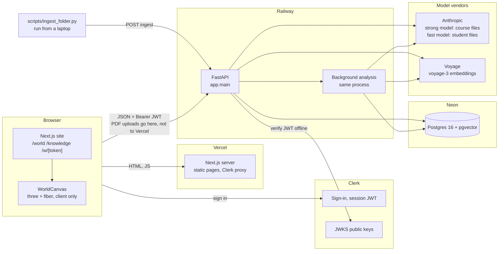
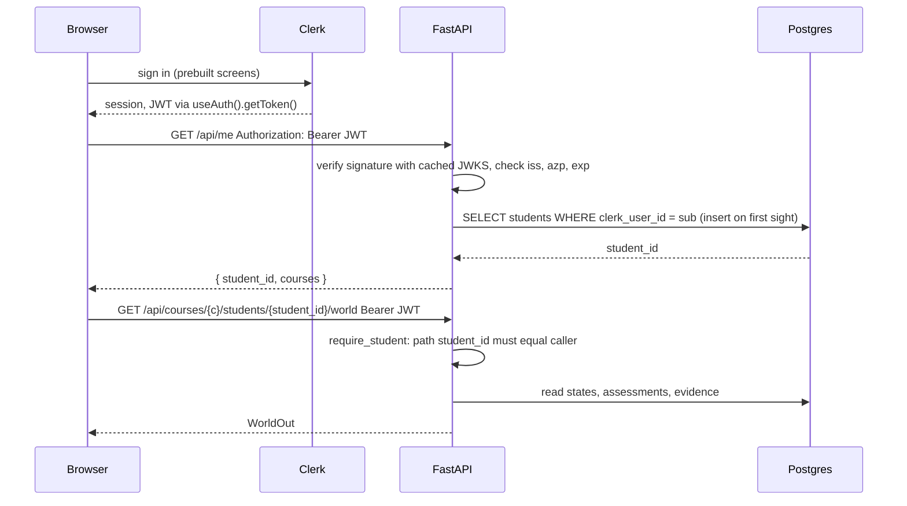
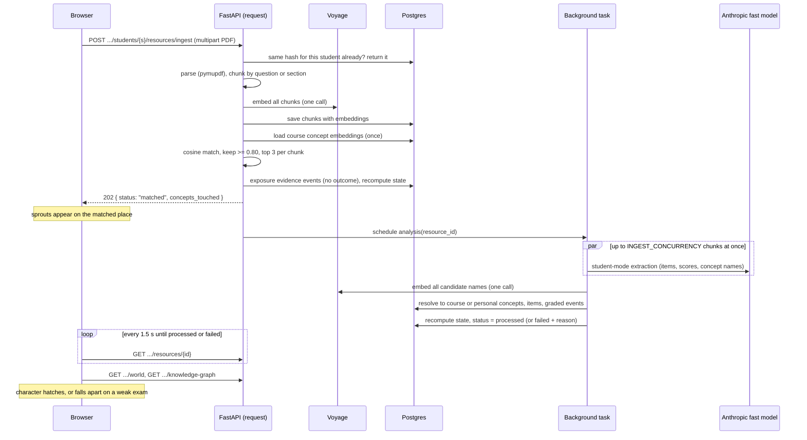
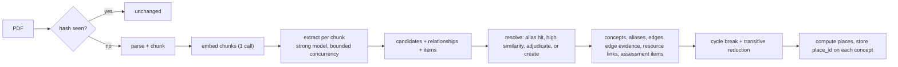
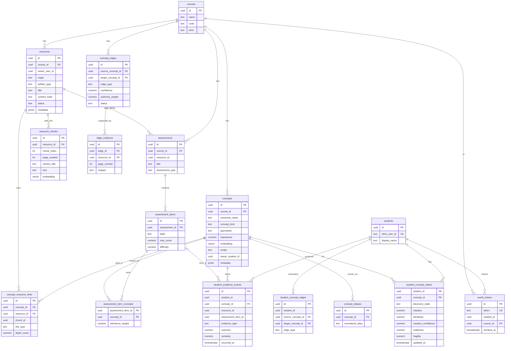
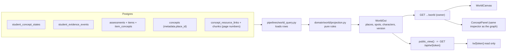
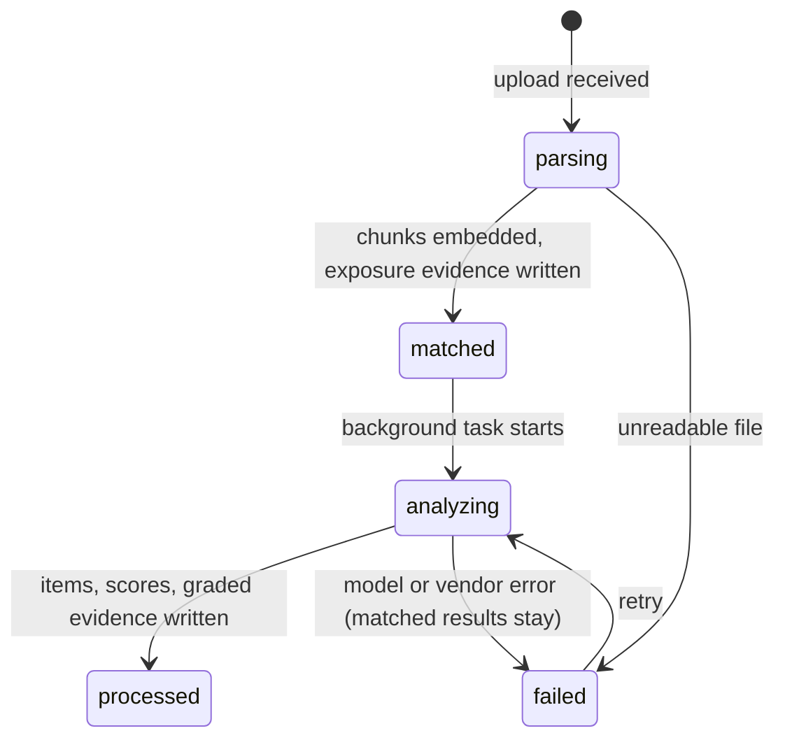
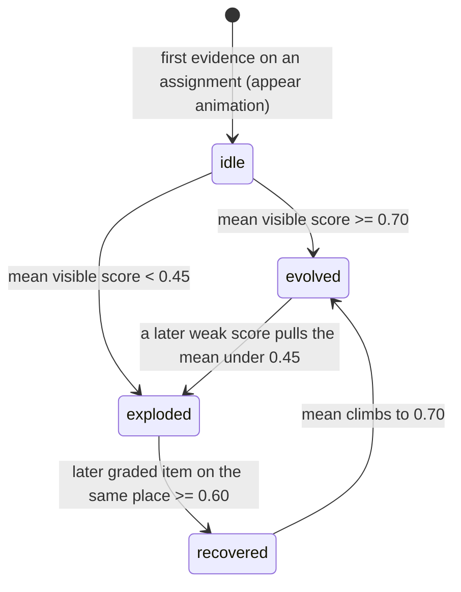
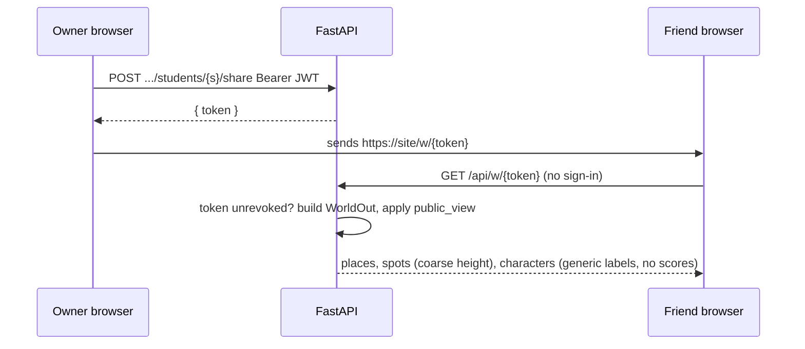

# Architecture

Diagrams for the system described in `build_spec.md`, `docs/prd.md` and `docs/plans/infra-and-build-plan.md`. Each diagram answers one question. Names match the code.

## What talks to what



Two hosts, one database, two vendors. The site never holds a model key. The API never renders.

## Who owns which code

```mermaid
flowchart TB
  subgraph web["frontend/  (web team)"]
    pages["app/*  routes"]
    shell["components/layout  AppShell, Sidebar, TopBar"]
    graph["components/graph  xyflow view"]
    inspector["components/concepts  ConceptPanel"]
    upload["components/upload  queue + status polling"]
    client["lib/api.ts  typed client, bearer token"]
    schema["lib/api/schema.ts  generated from /openapi.json"]
    store["lib/store.tsx  select(), reloadGraph()"]
    pages --> shell --> graph & inspector & upload
    graph & upload --> client --> schema
    shell --> store
  end

  subgraph world["frontend/components/world  (Philote)"]
    wpage["WorldPage  fetch + dynamic import"]
    wcanvas["WorldCanvas  props: world, readOnly, selectedId, onSelect"]
    island["Island, Props, Blob, Character"]
    wpage --> wcanvas --> island
    wpage --> client
    wcanvas -- "onSelect" --> store
  end

  subgraph api["backend/app  (Philote)"]
    routes["api/routes  me, resources, world, shares, knowledge-graph, mastery, study"]
    deps["api/dependencies  get_db, current_student, require_student"]
    auth["auth/clerk.py"]
    pipes["pipelines  student_ingestion, ingest_jobs, world_query, course_ingestion"]
    domain["domain  mastery, graph, personal_graph, world/projection  (pure, tested)"]
    repos["repositories  SQLAlchemy reads and writes"]
    providers["providers/llm  anthropic + voyage, fake"]
    routes --> deps --> auth
    routes --> pipes --> domain
    pipes --> repos
    pipes --> providers
  end

  client -- "HTTPS JSON" --> routes
```

The three arrows that cross a boundary are the ports: the generated schema, the store's `select` and `reloadGraph`, and the `WorldCanvas` props. Everything else can change inside its box without telling anyone.

## Sign-in and a protected read



`AUTH_MODE=dev` swaps the JWT step for an `X-Student-Id` header so scripts and local work do not need Clerk. Production never runs in dev mode.

## Student file ingest, two phases



Targets: phase A under two seconds, phase B under forty seconds for a five-page pset. Both are logged per file.

## Course file ingest



Only extraction is parallel. Writes stay in order so a relationship can name a concept found in an earlier chunk of the same file.

## Data model



`students` and `world_shares` are new tonight. `student_id` columns on older tables stay plain UUIDs; adding foreign keys to them is a Sunday change. `metadata.place_id` and `metadata.place_label` on `concepts` carry the island regions.

## From records to island



Rules that turn numbers into things on the island live in `projection.py` and in `docs/learning-model.md`. The browser never recomputes them.

## Status of a file



## Spot on the island

```mermaid
stateDiagram-v2
  [*] --> empty : concept unseen or frontier
  empty --> sprout : encountered or active (familiarity or any evidence)
  sprout --> landmark : mastery >= 0.60 and confidence >= 0.25
  landmark --> sprout : decay or negative evidence drops mastery
  note right of landmark : height follows mastery; cracked when fragility > 0.25
```



## Character on a place



Characters never disappear. A weak exam knocks them over; later work stands them back up.

## Visit


