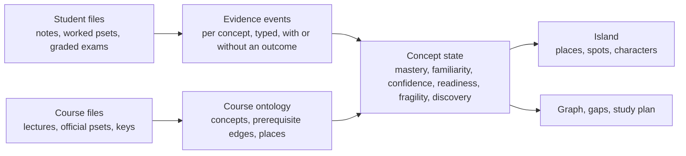

# Learning model: from evidence to island

What the engine knows about a student, how each number is produced, and what the island draws for it. Scoring formulas are in `backend/graph_engine/backend_build_spec.md`; the island rules are in `backend/app/domain/world/projection.py`. This page is the shared vocabulary between the two.

## The chain

One set of records, two views. If the island shows a landmark, the graph shows the same concept as strong. If the graph lists a gap, the island shows a cracked or empty spot in the same place.

## Evidence types and what they move

| Evidence type | Comes from | Has an outcome | Moves mastery | Moves familiarity |
| --- | --- | --- | --- | --- |
| `resource_view` | any file the student touched | no | no | yes |
| `student_notes` | notes, phase A match | no | no | yes |
| `worked_solution` | worked pset without visible grade, phase A match | no | no | yes |
| `self_explanation` | assessment item with no visible score | no | no | yes |
| `graded_homework`, `graded_quiz`, `graded_exam` | assessment item with a visible score | score / max | yes | yes |
| `verified_practice` | handwritten work whose correctness the reader could establish | correctness | yes | yes |
| `diagnostic` | a quiz we set (not tonight) | score | yes | yes |

Only events with an outcome move mastery. A pset you attempted but never got back raises familiarity and nothing else. That is why phase A can run before the file has been read closely: it only writes exposure evidence.

## Per-concept numbers

| Field | Meaning | Produced by | Range |
| --- | --- | --- | --- |
| `discovery_state` | unseen, frontier, encountered, active | evidence count and familiarity, plus prerequisite adjacency for frontier | enum |
| `mastery` | how well the student can do it | Beta posterior over outcome-bearing events with recency decay; 0.5 with no evidence, reported null until scored | 0 to 1 |
| `familiarity` | how much they have seen it | 1 minus exp of summed exposure | 0 to 1 |
| `confidence` | how sure the engine is about mastery | 1 minus exp of half the effective evidence count | 0 to 1 |
| `readiness` | prerequisites in place to learn this | 0.65 mastery plus 0.35 prerequisite support | 0 to 1 |
| `fragility` | looks strong but the prerequisites under it are weak | mastery times one minus prerequisite support | 0 to 1 |
| `importance` | how central to the course | set at extraction from the course files | 0 to 1 |
| `personal_relevance` | how much this concept matters to this student | familiarity plus mastery, capped at 1 | 0 to 1 |
| `scope` | course, personal, shared_extension | course files create course concepts; student files can only create personal ones | enum |

## What the island draws

The island has a small number of visual channels. Each field gets one, and no channel carries two fields, so a viewer can read the island without a legend.

| Field | Tonight | Later |
| --- | --- | --- |
| `name` | label on hover and in the inspector | name plate on landmarks at close zoom |
| `scope` | personal concepts sit in a small fenced pocket at the edge of their nearest place, different ground colour | shared extensions as a bridge between two students' pockets |
| `discovery_state` | unseen and frontier: fog, spot not drawn. encountered and active: spot drawn | frontier as faint silhouettes so the coast reads as "more to discover" |
| `mastery` | landmark height (state 2 only) | landmark grows through three size steps |
| `familiarity` | sprout size within state 1 (small, medium, tall grass) | vegetation density across the place |
| `confidence` | not drawn tonight; it gates whether a landmark exists at all (confidence at least 0.25) | low-confidence landmark drawn as scaffolding or translucent |
| `readiness` | top three frontier spots by readiness glow softly ("next up") | a lit path from the strongest landmark to the readiest frontier spot |
| `fragility` | cracks on the spot when above 0.25; the landmark wobbles slightly | cracks widen with fragility; a tremor when a prerequisite loses mastery |
| `importance` with `personal_relevance` | spot footprint radius, three sizes | place area scales with summed importance |
| `hidden_concept_count` | width of the unexplored coast ring | fog bank density |

Place biome comes from the place index (forest, meadow, ice, city, sand), not from any score. Biomes are for telling regions apart, not for meaning.

## Thresholds

| Rule | Value | Where it lives |
| --- | --- | --- |
| Spot becomes a landmark | mastery at least 0.60 and confidence at least 0.25 | `projection.py` |
| Spot is cracked | fragility above 0.25 | `projection.py` |
| Character evolved | mean visible score at least 0.70 | `projection.py` |
| Character exploded | mean visible score under 0.45 | `projection.py` |
| Character recovered | exploded, and a later graded item on the same place scored at least 0.60 | `projection.py` |
| Phase A match | cosine at least 0.80, top three per chunk | `Settings.match_threshold` |
| Concept merge on ingest | cosine at least 0.94 merges, 0.82 to 0.94 asks the model, below creates | `Settings` |
| Gap engine "mastered" | 0.75 | `Settings.gap_mastered_threshold` |

The landmark threshold is lower than the gap engine's 0.75 on purpose: the island should show progress before the study plan stops nagging. Both numbers are visible in one place each so they can be tuned together.

## Characters

A character is one assignment the student has evidence on: a homework, quiz or exam. It stands on the place its items point to most. It is a record of a moment, so it stays. Its state follows the visible scores on that assignment, and later work on the same place can stand it back up.

Why per assignment and not per item or per concept: a pset with eight questions should feel like one visitor arriving, not eight. Concepts already have spots. Assignments are the unit the student remembers ("pset 3 went badly").

## Personal concepts

When a student's notes name something the course never defined, the engine creates a personal concept owned by that student. It never becomes a course concept on its own. On the island it appears in a pocket at the edge of the nearest place, so a student who reads ahead sees their own additions without the course ontology moving.

## User stories

Each story ends with the check that proves it.

1. New student. I sign in for the first time and pick a course. I see the whole island in fog with the place outlines visible. Nothing is drawn as mine yet. Check: `/world` for a fresh student returns all spots at state 0 and no characters.
2. First file. I drop my worked pset 2. Within two seconds sprouts appear on one or two places. Half a minute later a character stands on the place the pset was mostly about, and clicking it shows "Homework 2, items Q1 to Q4, no visible scores" and the lecture pages those concepts are cited to. Check: status goes matched then processed; one character; exposure events only until phase B; no graded events without visible scores.
3. Graded work. I drop the same pset after it was graded, with scores written on it. The character grows up if I did well. Landmarks rise where the items pointed. Check: same assessment gets outcome-bearing events; mastery moves; character state changes; no second character.
4. Bad exam. I drop a midterm where one topic went badly. Characters on that place fall apart and the ground cracks where prerequisites are weak. The Gaps tab lists those concepts first. Check: exploded state; fragility over 0.25 on spots whose prerequisites have low mastery; gaps endpoint agrees.
5. Recovery. I work the topic again and drop a later graded pset that scores well there. The fallen characters stand back up. Check: state recovered on the exam's character, evolved on the new one.
6. Same file twice. I accidentally drop a file I already uploaded. Nothing changes. Check: identical resource id returned, zero new events.
7. Same truth in two views. I click a landmark on the island and then the same node in the graph. Both open the same inspector with the same numbers. Check: world and knowledge-graph endpoints agree on every concept id, discovery state and mastery.
8. Sharing. I copy a visit link and my friend opens it without an account. They see my island, can orbit and click, see "Exam 1" fell apart, but never see file names, scores, or mastery values. Check: the visit payload contains none of those strings.
9. Privacy. Another signed-in student tries my paths with their own token. Every call is refused. Check: 403 on read and write.
10. Returning. I come back the next day. The island is where I left it and loads under three seconds. Check: cold load timing on the deployed site.
